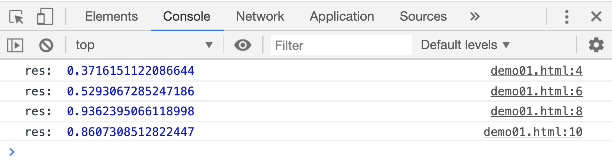
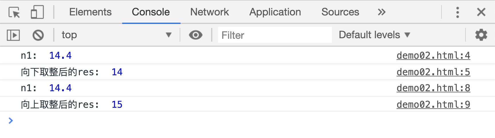
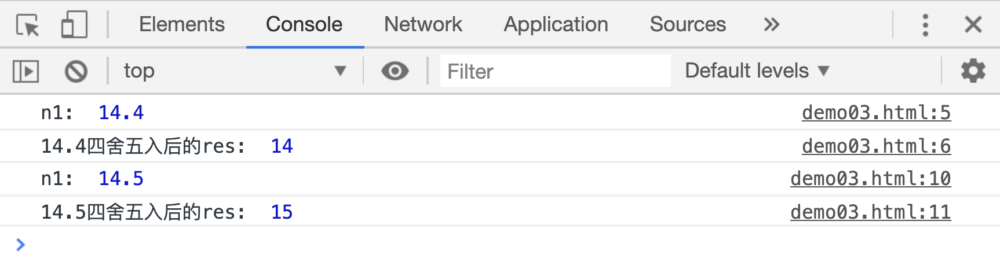
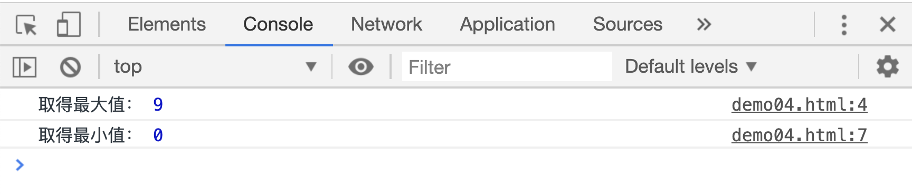

# Math 对象及其运用

`Math` 是 JS 提供的用于执行数学任务的对象，比如初中学过的绝对值、最低值、最高值、正弦值、余弦值、正切值等等。

## Math.random()

`Math.random()`方法用来获取一个随机数，这个随机数介于 0 和 1 之间，且不会等于 0 或 1。每一次执行的返回值都不相同。

```html
<script>
    var res;
    res = Math.random();
    console.log("res: ", res);

    res = Math.random();
    console.log("res: ", res);

    res = Math.random();
    console.log("res: ", res);

    res = Math.random();
    console.log("res: ", res);
</script>
```

[](./demo/demo01.html)



## Math.floor()和 Math.ceil()

`Math.floor(num)`方法用于对`num`向下取整，`Math.ceil(num)`则刚好相反，用于向上取整。

```html
<script>
    var n1 = 14.4;
    var res = Math.floor(n1);
    console.log("n1: ", n1);
    console.log("向下取整后的res: ", res);

    res = Math.ceil(n1);
    console.log("n1: ", n1);
    console.log("向上取整后的res: ", res);
</script>
```

[](./demo/demo02.html)



## Math.random()

`Math.random()`方法用于四舍五入，返回四舍五入后的结果

```html
<script>
    var n1, res;
    n1 = 14.4;
    res = Math.round(n1);
    console.log("n1: ", n1);
    console.log("14.4四舍五入后的res: ", res);

    n1 = 14.5;
    res = Math.round(n1);
    console.log("n1: ", n1);
    console.log("14.5四舍五入后的res: ", res);
</script>
```

[](./demo/demo03.html)



## Math.max()和 Math.min()

`Math.max(a,b,c...)`和`Math.min(a,b,c...)`分别用来获取所有参数中的最大值和最小值，并返回该值。

```html
<script>
    var res;
    res = Math.max(1, 3, 5, 7, 9, 2, 0);
    console.log("取得最大值：", res);

    res = Math.min(1, 3, 5, 7, 9, 2, 0);
    console.log("取得最小值：", res);
</script>
```

[](./demo/demo04.html)



## Math.PI

`Math.PI`可以获取最常用的`圆周率`。

```html
<script>
    console.log("Math.PI: ", Math.PI);
</script>
```

> 注意：`PI`是`Math`对象的一个属性，不是`Math`的方法，不需要`()`
