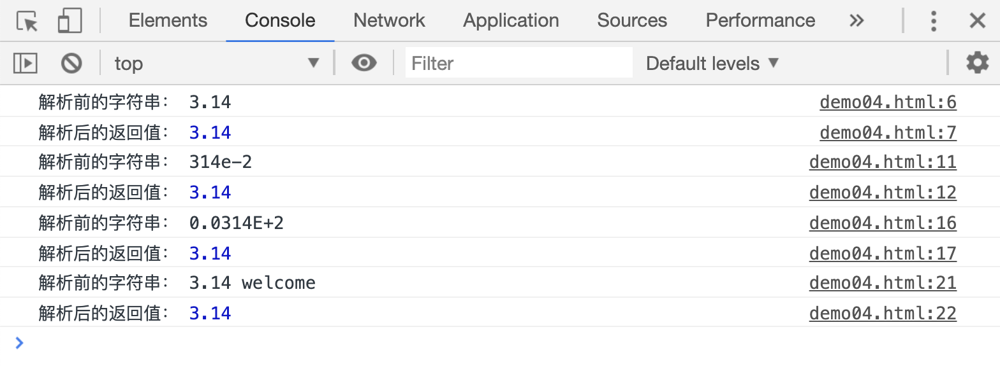

# 把字符串转为数字

JS 提供了两种全局函数，用于解析字符串，并将目标转成一个数字：`parseInt()`和`parseFloat()`

## parseInt(string [, radio])

`parseInt(string [, radio])`用于把字符串解析为数字，返回解析后的<u>整数值</u>，如果被解析的字符串第一个字符不能被转换成数值类型，返回`NaN`

`radio`参数用于指定第一个参数的基数(进制表示方式)，比如设置为 10，表示第一个参数采用了十进制表示法，设置为 2，表示第一个参数采用了 2 进制表示法，没有指定时，会根据以下规则：

1. 如果字符串 string 以"0x"或者"0X"开头, 则基数是 16 (16 进制).
2. 如果字符串 string 以"0"开头, 基数是 8（八进制）或者 10（十进制），那么具体是哪个基数由实现环境决定。
3. ECMAScript 5 规定使用 10，但是并不是所有的浏览器都遵循这个规定。因此，<u>永远都要明确给出 radix 参数的值</u>。
4. 如果字符串 string 以其它任何值开头，则基数是 10 (十进制)。

```html
<script>
    var a, res;
    a = "40 year";
    res = parseInt(a);
    console.log("解析前的字符串：", a);
    console.log("解析后的返回值：", res);
</script>
```

[](./demo/demo01.html)


```html
<script>
    var a, res;

    a = "015";
    res = parseInt(a);
    console.log("解析前的字符串：", a);
    console.log("解析后的返回值：", res);

    a = "015";
    res = parseInt(a, 8);
    console.log("解析前的字符串：", a);
    console.log("解析后的返回值：", res);
</script>
```

[](./demo/demo02.html)


```html
<script>
    var a, res;

    a = "0xF";
    res = parseInt(a);
    console.log("解析前的字符串：", a);
    console.log("解析后的返回值：", res);

    a = "0xF";
    res = parseInt(a, 16);
    console.log("解析前的字符串：", a);
    console.log("解析后的返回值：", res);

    a = "0xF";
    res = parseInt(a, 8);
    console.log("解析前的字符串：", a);
    console.log("解析后的返回值：", res);
</script>
```

[](./demo/demo03.html)


## parseFloat(string)

`parseFloat(string)`用于把字符串解析为数字，返回解析后的<u>浮点数</u>，如果参数不能转为数值，返回`NaN`

```html
<script>
    var a, res;

    a = "3.14";
    res = parseFloat(a);
    console.log("解析前的字符串：", a);
    console.log("解析后的返回值：", res);

    a = "314e-2";
    res = parseFloat(a);
    console.log("解析前的字符串：", a);
    console.log("解析后的返回值：", res);

    a = "0.0314E+2";
    res = parseFloat(a);
    console.log("解析前的字符串：", a);
    console.log("解析后的返回值：", res);

    a = "3.14 welcome";
    res = parseFloat(a);
    console.log("解析前的字符串：", a);
    console.log("解析后的返回值：", res);
</script>
```

[](./demo/demo04.html)


