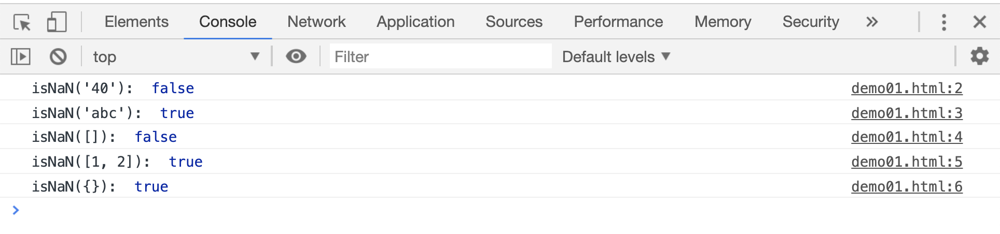

# 判断目标是否是数字

`isNaN(num)`也是一个全局函数，用来判断目标是否不是一个数字，返回布尔值；如果参数不是一个数字，返回`true`，如果是一个数字，返回`false`。

> 在判断的过程中，会把参数尝试着转为一个数值。

```html
<script>
    console.log("isNaN('40'): ", isNaN("40"));
    console.log("isNaN('abc'): ", isNaN("abc"));
    console.log("isNaN([]): ", isNaN([]));
    console.log("isNaN([1, 2]): ", isNaN([1, 2]));
    console.log("isNaN({}): ", isNaN([1, 2]));
</script>
```

[](./demo/demo01.html)


