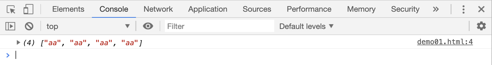
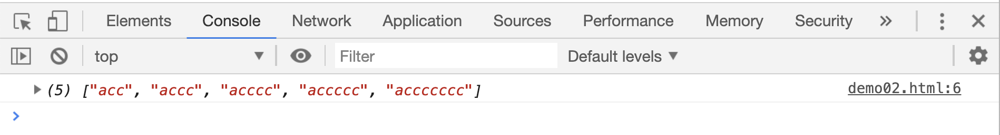
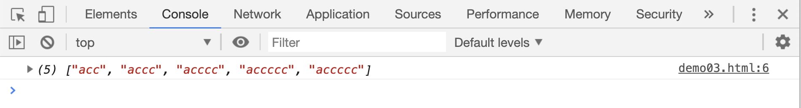
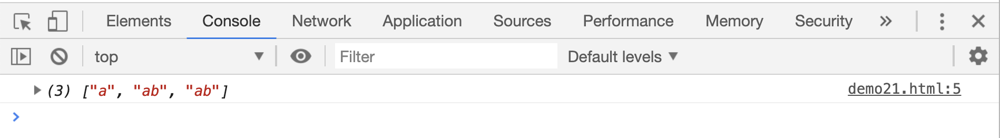
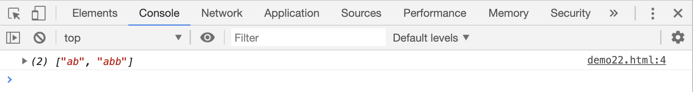
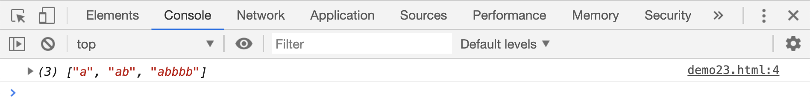

# 表示数量的符号

## `{}`符号

`{}`符号在正则表达式中，用来指定前面内容连续出现的次数

```html
<script>
    var res;
    res = "a aa aaa aaaa".match(/a{2}/g);
    console.log(res);
</script>
```

[案例源码](./demo/demo01.html)



> 从结果中可以看到，`match` 方法把所有的连续 2 个 `a` 的字符全部都查找出来了

`{}`还有一种用法: `[m,]`，用来表示前一个字符的数量至少要出现`m`次,才能被匹配到

```html
<script>
    var res;
    res = "li ac ly acc lei accc yang acccc wang accccc ling accccccc".match(
        /ac{2,}/g,
    );
    console.log(res);
</script>
```

[案例源码](./demo/demo02.html)



> 上面案例中没有匹配到`ac`，是因为它里面只有一个`c`，而正则中要求至少出现 2 次`c`才可以被匹配到

`[m,n]`则表示前一个字符的数量至少出现`m`次，顶多出现`n`次，才能被匹配到：

```html
<script>
    var res;
    res = "li ac ly acc lei accc yang acccc wang accccc ling accccccc".match(
        /ac{2,5}/g,
    );
    console.log(res);
</script>
```

[案例源码](./demo/demo03.html)



> 上面案例中，正则表达式要求字符`c`至少出现 2 次，最多不超过 5 次才能被匹配到。所以`ac`和`acccccc`不在返回的数组中。

## `?`、`+`和`*`

`?`在正则表达式中相当于`{0,1}`，表示前一个字符可有可无，要么没有，要么只出现 1 次

```html
<script>
    var res;
    res = /ab?/.test("a");
    res = "a ab abb".match(/ab?/g);
    console.log(res);
</script>
```

[案例源码](./demo/demo04.html)



`+`在正则表达式中相当于`{1,}`，表示前一个字符至少出现 1 次，或连续出现多次

```html
<script>
    var res;
    res = "a ab abb".match(/ab+/g);
    console.log(res);
</script>
```

[案例源码](./demo/demo05.html)



`*`在正则表达式中相当于`{0,}`，表示前面的字符没有，或连续出现多次

```html
<script>
    var res;
    res = "a ab abbbb".match(/ab*/g);
    console.log(res);
</script>
```

[案例源码](./demo/demo06.html)


