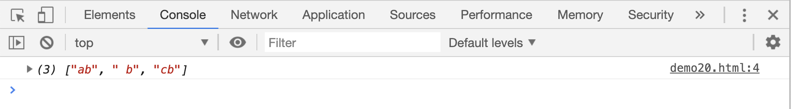
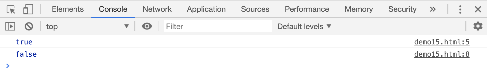
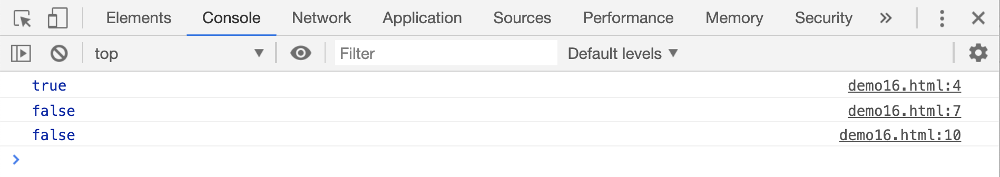
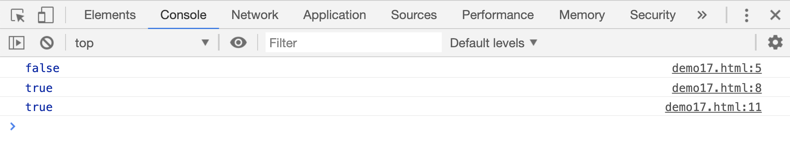

# 元数据符号

## `.`符号

`.`在正则表达式中相当于 `[^\n]`,表示换行符之外的任意一个字符

```html
<script>
    var res;
    res = "b ab b cb \nb".match(/.b/g);
    console.log(res);
</script>
```

[案例源码](./demo/demo01.html)



## `\d`和`\D`

`\d`在正则表达式中，表示一个数值类型的字符，相当于前面讲的`[0-9]`；而`\D`正好与`\d`相反，表示一个非数值类型，相当于`[^0-9]`。

```html
<script>
    // 判断字符串是否以一个数字开头：
    var res;
    res = /^\d/.test("2 welcome");
    console.log(res);

    res = /^\d/.test("welcom");
    console.log(res);
</script>
```

[](./demo/demo02.html)



比如说，想判断目标是否是一个 11 位的数字，可以这么写

```html
<script>
    var res;
    res = /^\d{11}$/.test("18516081294");
    console.log(res); // true

    res = /^\d{11}$/.test("185160812943");
    console.log(res); // false

    res = /^\d{11}$/.test("1851608129");
    console.log(res); // false
</script>
```

[案例源码](./demo/demo03.html)



## `\w`和`\W`

`\d`在正则表达式中，匹配所有的大小写字母、数字和下划线，相当于`[0-9a-zA-Z_]`；而`\W`正好与`\w`相反，相当于`[^0-9a-zA-Z_]`。

```html
<script>
    // 判断目标是否包含大小写字母、数字或下划线
    var res;
    res = /\w/.test("@#-=+");
    console.log(res);

    res = /\w/.test("185160812w943");
    console.log(res);

    res = /\w/.test("18516081_29");
    console.log(res);
</script>
```

[案例源码](./demo/demo04.html)


