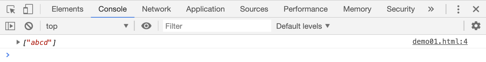
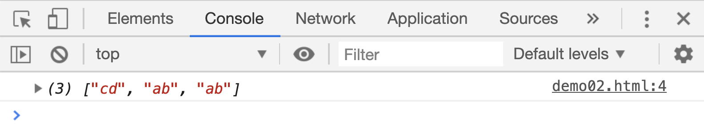
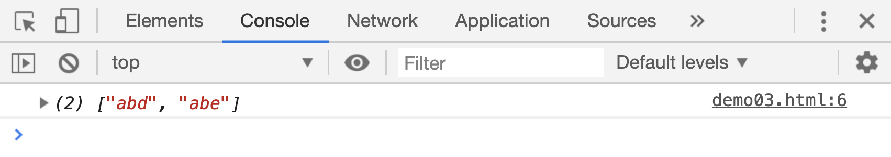

# 正则表达式中的或

`|`符号，在正则表达式对象中表示`或`的意思。前面讲过单独一个字符在正则表达式中都会占据一个位置

```html
<script>
    var res;

    res = "abcd".match(/abcd/g);
    console.log(res);
</script>
```

[案例源码](./demo/demo01.html)



上面代码的匹配项是完整的`abcd`，如果在`b`和`c`之前添加一个`|`，意思就不同了，表示判断字符串中是否包含字符`ab`或者字符`cd`:

```html
<script>
    var res;
    res = "acd abd abd".match(/ab|cd/g);
    console.log(res);
</script>
```

[案例源码](./demo/demo02.html)



所以`|`通常也会会放在`()`中使用，比如：

```html
<script>
    var res;

    // 判断字符串中是是否有字符ab，且后面紧跟着一个d或者e字符：
    res = "abc abd abe".match(/ab(d|e)/g);
    console.log(res);
</script>
```

[案例源码](./demo/demo03.html)


