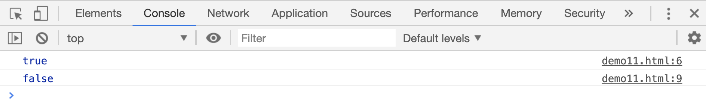
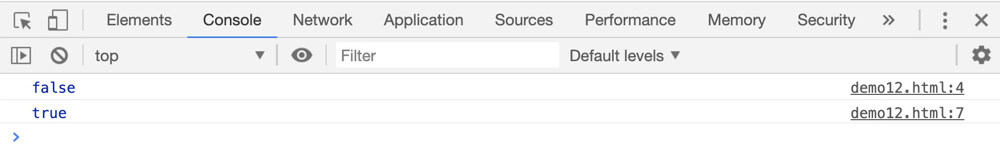
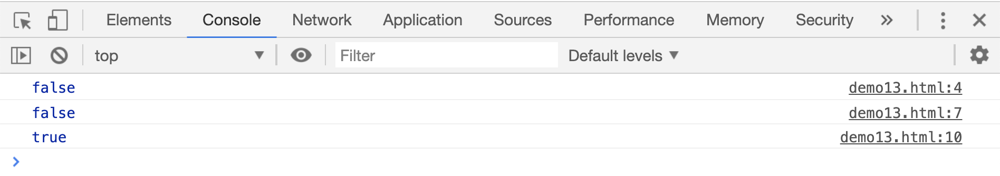
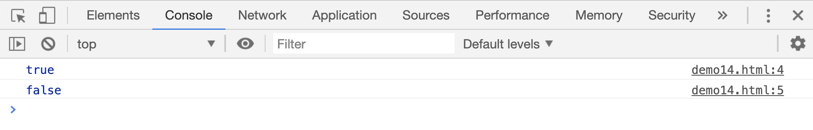
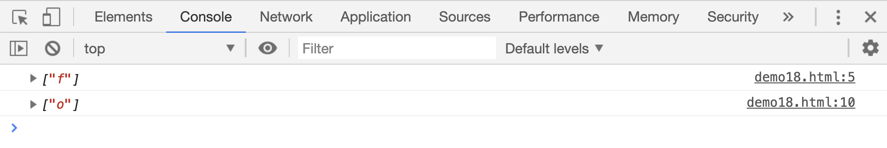
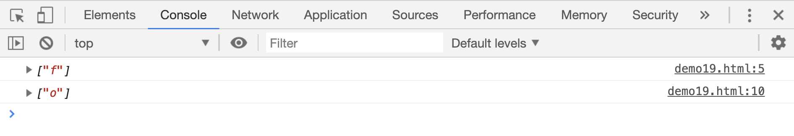

# 表示边界的符号

## `^`符号

`^`在正则表达式开头时，用来判断目标是否以指定字符开头

```html
<script>
    // 判断字符串是否以字母w开头：
    var res;

    res = /^w/.test("welcome");
    console.log(res);

    res = /^w/.test("elcome welcome");
    console.log(res);
</script>
```

[案例源码](./demo/demo01.html)



如果`^`出现在`[]`之间，表示`非`的意思，是一个反向的字符集合。比如`/[^abcd]/`表示 1 个`abcd`之外的字符，`/[^abcd]/{2}`表示至少连续 2 个`abcd`以外的字符

```html
<script>
    var res;
    res = /[^abcd]/g.test("abcd");
    console.log(res);

    res = /[^abcd]/g.test("abcdef");
    console.log(res);
</script>
```

[案例源码](./demo/demo02.html)



如果在整体前面加一个`^`，意思就又不同了`/^[^abcd]/g`表示判断目标是否是以`非abcd四个字符中任意一个字符`开头
，也就是说，如果目标字符串的第一个字母是`abcd`中的任何一个，`test()`函数都会返回`false`

```html
<script>
    var res;
    res = /^[^abcd]/g.test("abcd");
    console.log(res);

    res = /^[^abcd]/g.test("bcd");
    console.log(res);

    res = /^[^abcd]/g.test("ebcd");
    console.log(res);
</script>
```

[案例源码](./demo/demo03.html)



## `$`符号

`$`在正则表达式中表示结尾，用来判断目标是否以指定字符结尾

```html
<script>
    // 判断字符串是否以字母w结尾：
    var reg = /e$/;
    console.log(reg.test("welcome"));
    console.log(reg.test("welcom"));
</script>
```

[案例源码](./demo/demo04.html)



## `\b`和`\B`

`\b\`在正则表达式中表示“单词边界”，意思是它后面的字符是单词的第一个字符，或者它前面的字符是单词的最后一个字符。

```html
<script>
    var res;
    // 匹配所有单词第一个字符是f的字符
    res = "foo efo".match(/\bf/g);
    console.log(res);
    // 这里匹配的是foo中的f

    // 匹配所有单词中最后一个字符是o的字符
    res = "fro for".match(/o\b/g);
    console.log(res);
    // 这里匹配的是fro中的o
</script>
```

[案例源码](./demo/demo05.html)



`\B`刚好和`\b`相反，意思是他后面的字符不是单词的第一个字符，或者它前面的字符不是单词的最后一个字符

```html
<script>
    var res;
    // 匹配所有单词第一个字符不是f的字符
    res = "foo efo".match(/\Bf/g);
    console.log(res);
    // 这里匹配的是efo中的f

    // 匹配所有单词中最后一个字符不是o的字符
    res = "fro for".match(/o\B/g);
    console.log(res);
    // 这里匹配的是for中的o
</script>
```

[案例源码](./demo/demo06.html)


