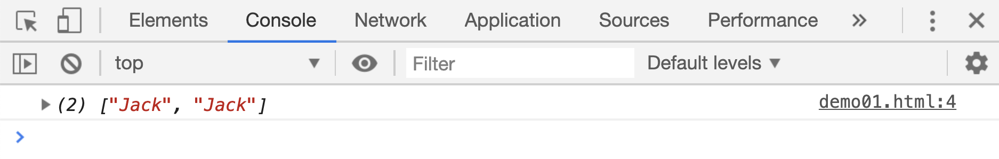
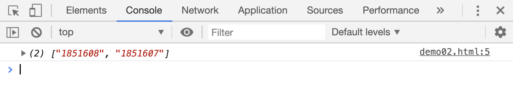
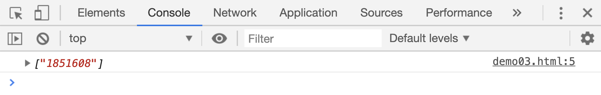

# 正向肯定和否定查找

## `x(?=y)`正向肯定查找

`x(?=y)`在正则表达式中，表示字符 x 后必须跟一个 y 才算匹配项。比如：

```html
<script>
    var res;
    res = "JackMa JackLv JackMang".match(/Jack(?=M)/g);
    console.log(res);
</script>
```

[案例源码](./demo/demo01.html)



> 这里要注意返回的匹配项中，是不包含`()`内字符的，所以两次匹配内容都只有`Jack`

但是这样返回的匹配项都是一模一样的，有什么用呢？再来看一个案例：

```html
<script>
    var res;
    // 找到字符串中所有以1294结尾的手机号码的前7位数字
    res = "18516081294  18516081293 18516071294".match(/\d{7}(?=1294)/g);
    console.log(res);
</script>
```

[案例源码](./demo/demo02.html)



## `x(?!y)`正向否定查找

`x(?!y)`在正则表达式中和`x(?=y)`刚好相反，表示字符`x`后面没有跟随字符`y`的才算做匹配项，还是以手机号码为例，这次我们查找所有不是以`1294`结尾的手机号码的前 7 位：

```html
<script>
    var res;
    // 找到字符串中所有不是以1294结尾的手机号码的前7位数字
    res = "18516081294  18516081293 18516071294".match(/185\d{4}(?!1294)/g);
    console.log(res);
</script>
```

[案例源码](./demo/demo03.html)


