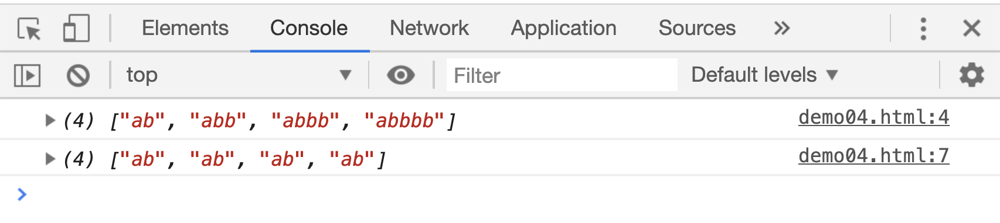
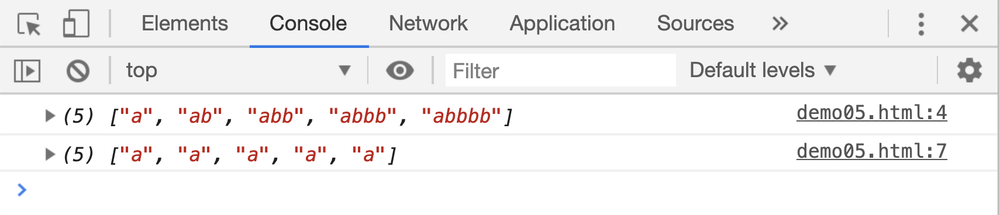
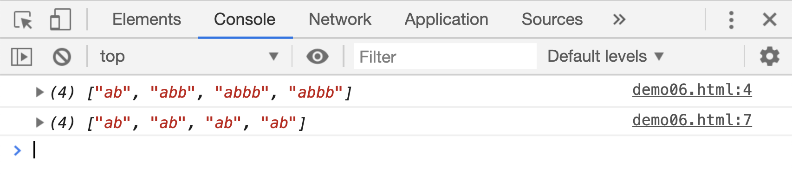

# 贪婪模式和非贪婪模式

直接从例子中看一下 贪婪模式和非贪婪模式的区别：

```html
<script>
    var res;
    res = "a ab abb abbb abbbb".match(/ab+/g);
    console.log(res);

    res = "a ab abb abbb abbbb".match(/ab+?/g);
    console.log(res);
</script>
```

[案例源码](./demo/demo01.html)



这段代码中，正则表达式只有一个不同点，那就是`+`后面跟了一个`?`。没有`?`符号的时候，默认是“贪婪模式”，有几个匹配的字符`b`，都会显示出来，加上一个`?`之后，就变成了非贪婪模式。非贪婪模式下的匹配项，只会显示最少的字符`b`。

除了`+`后面跟一个`?`可以变成非贪婪模式，还有`*`也可以：

```html
<script>
    var res;
    res = "a ab abb abbb abbbb".match(/ab*/g);
    console.log(res);

    res = "a ab abb abbb abbbb".match(/ab*?/g);
    console.log(res);
</script>
```

[案例源码](./demo/demo02.html)



可以看到，非贪婪模式下，由于会显示最少次数的`b`，返回的匹配项集合中，直接省去了字符`b`。

实际上量词`{}`也是可以使用非贪婪模式的，比如：

```html
<script>
    var res;
    res = "a ab abb abbb abbbb".match(/ab{1,3}/g);
    console.log(res);

    res = "a ab abb abbb abbbb".match(/ab{1,3}?/g);
    console.log(res);
</script>
```

[案例源码](./demo/demo03.html)


