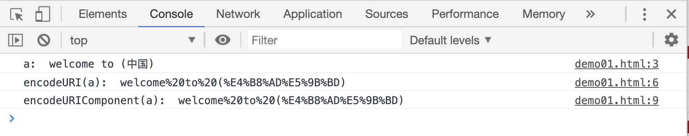
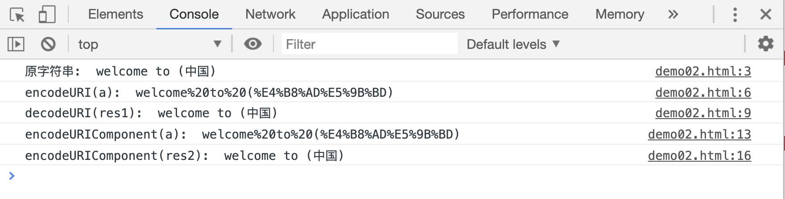

# 编码和解码字符串

编码表示用指定字符代替字符串中的特殊字符，解码则相反，通过固定的规则把编码后字符中的某些字符返回为原本的样子。

`encodeURI(str)`和`encodeURIComponent(str)`都用来对字符串中的特殊字符进行编码。他们的区别在于：

1. `encodeURI(str)`会替换`; , / ? : @ & = + $ 字母 数字 - _ . ! ~ * ' ( ) #`之外的所有字符
2. `encodeURIComponent(str)`则会替换所有`字母、数字、(、)、.、!、~、*、'、- _`之外的所有字符

> 这两种方法都是属于全局函数，不属于任何对象，在代码的任意位置都可以使用

```html
<script>
    var a = "http://www.baidu.com?name=张三&height=30#11";
    console.log("a: ", a);

    var res1 = encodeURI(a);
    console.log("encodeURI(a): ", res1);

    var res2 = encodeURI(a);
    console.log("encodeURIComponent(a): ", res2);
</script>
```

[](./demo/demo01.html)



`decodeURI(str)`和`decodeURIComponent(str)`方法则是对被编码后的字符进行解码。

```html
<script>
    var a = "welcome to (中国)";
    console.log("原字符串: ", a);

    // 编码
    var res1 = encodeURI(a);
    console.log("encodeURI(a): ", res1);
    // 解码
    var str1 = decodeURI(res1);
    console.log("decodeURI(res1): ", str1);

    // 编码
    var res2 = encodeURI(a);
    console.log("encodeURIComponent(a): ", res2);
    // 解码
    var str2 = decodeURI(res2);
    console.log("encodeURIComponent(res2): ", str2);
</script>
```

[](./demo/demo02.html)



那么能不能让四种编码解码方式交叉使用呢？比如我用`encodeURI`编码，用`decodeURIComponent`解码，或者使用`encodeURIomponent`编码，用`decodeURI`解码呢？可以自行测试，但是建议最好还是使用配套的编码、解码函数。下面提供一个交叉使用的案例：

```html
<script>
    var a = "welcome to (@中国)";
    console.log("原字符串: ", a);

    // 编码
    var res1 = encodeURI(a);
    console.log("encodeURI(a): ", res1);
    // 解码
    var str1 = decodeURIComponent(res1);
    console.log("decodeURIComponent(res1): ", str1);

    // 编码
    var res2 = encodeURIComponent(a);
    console.log("encodeURIComponent(a): ", res2);
    // 解码
    var str2 = decodeURI(res2);
    console.log("decodeURI(res2): ", str2);
</script>
```

[](./demo/demo03.html)


