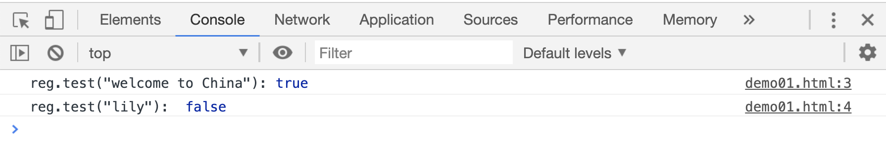
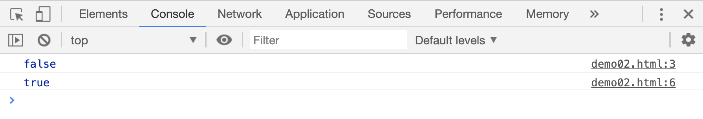
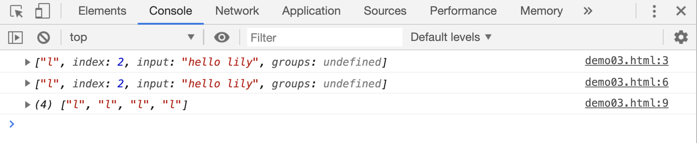
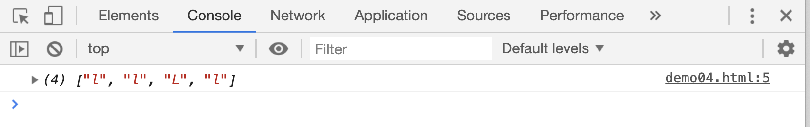
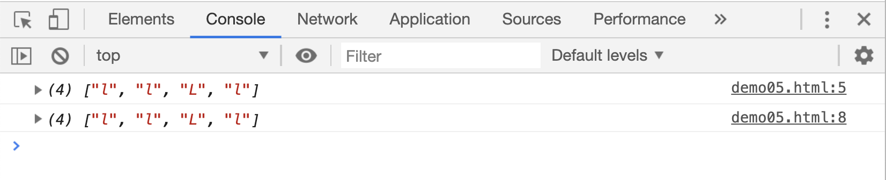
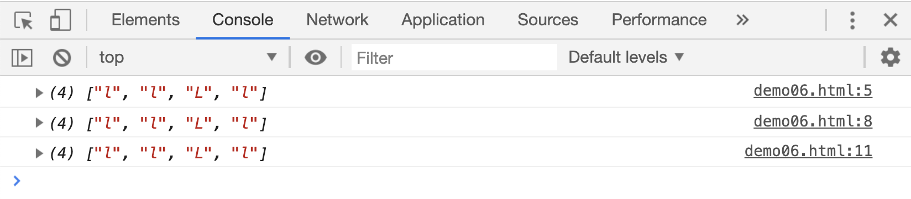

# 正则表达式

先来回忆一下之前讲过的字符串中用来查找是否包含指定字符的方法。

```js
string.includes(str); // 返回一个布尔值
string.indexOf(str); // 返回第一次出现的位置
```

但是这两种方法都有一个缺陷，参数中的字符是固定的，只能检查固定的连续多个字符，如果需要判断“字符串中是否有至少 3 个数值”就得自己单独封装一个函数去实现了。

这个时候，就轮到“正则表达式”出场了！

## regexp.test()

首先来说一个正则表达式对象的方法：`regexp.test(string)`

`regexp.text(string)`用来判断参数中是否包含指定规则的字符，如果有返回`true`, 没有返回`false`

```html
<script>
    var reg = new RegExp("c");
    console.log('reg.test("welcome to China"):', reg.test("welcome to China"));
    console.log('reg.test("lily"): ', reg.test("lily"));
</script>
```

[](./demo/demo01.html)



## 查找方式

下面正式来是说正则表达式，正则表达式可以通过`new RegExp(pattern, flag)`的方式来创建。

其中`pattern`是一个字符串，是正则表达式的文本部分，`flag`用来指定匹配的规则，比如：

| flag 规则 | 作用                                                          |
| --------- | ------------------------------------------------------------- |
| `g`       | 在全局中搜索和`pattern`匹配的字符，而不是找到第一个后就停止了 |
| `i`       | 搜索的时候忽略大小写                                          |
| `m`       | 在多行中进行搜索，而不是在当前一行中搜索                      |

比如，我们想在`welcome`中查找是否包含字符`C`，正常情况下，使用`test()`会返回一个`false`，但是如果给 `flag` 中指定了“不区分大小写”，返回值就变成`true`了。

```html
<script>
    var reg1 = new RegExp("C");
    console.log(reg1.test("welcome"));

    var reg1 = new RegExp("C", "i");
    console.log(reg1.test("welcome"));
</script>
```

[](./demo/demo02.html)



再来看一下前面讲过的字符串的`match`方法，`match`方法第一个参数可以使用正则表达式对象。

```html
<script>
    var reg;
    console.log("hello lily".match("l"));

    reg = new RegExp("l");
    console.log("hello lily".match(reg));

    reg = new RegExp("l", "g");
    console.log("hello lily".match(reg));
</script>
```

[](./demo/demo03.html)



上面案例中，给第二个参数设置为`g`之后，`match`方法返回了所有匹配的字符`l`组成的新数组。这里就看出来区别了，没有`g`的时候，只会取出第一次匹配字符，添加`g`的时候，会取出所有的匹配字符。

正则表达式对象中第二个参数也可以组合使用：

```html
<script>
    var reg;

    reg = new RegExp("l", "gi");
    console.log("hello Lily".match(reg));
</script>
```

[](./demo/demo04.html)



上面代码中，正则表达式对象的意义是：找到所有的字符`l`，且忽略大小写。因此 match 方法返回了的数组中，既有大写的`L`， 又有小写的`l`。

上面案例中正则表达式对象的第一个参数，还可以用以下方式来代替：

```html
<script>
    var reg;

    reg = new RegExp("l", "gi");
    console.log("hello Lily".match(reg));

    reg = new RegExp(/l/, "gi");
    console.log("hello Lily".match(reg));
</script>
```

[](./demo/demo05.html)



这种使用`/`开头和结尾的方式，叫做“正则字面量”。他们的作用是相同的。

实际上声明一个正则表达式对象作为变量值时，还可以直接使用下面的方式：

```html
<script>
    var reg;

    reg = new RegExp("l", "gi");
    console.log("hello Lily".match(reg));

    reg = new RegExp(/l/, "gi");
    console.log("hello Lily".match(reg));

    // 新的写法：
    reg = /l/gi;
    console.log("hello Lily".match(reg));
</script>
```

[](./demo/demo06.html)



新的写法中省略了`new Regexp()`的写法，直接使用`/`开头，并且把查找模式放在结尾的`/`后面，很明显这种方式比使用`new RegExp()`更简洁，高效。
