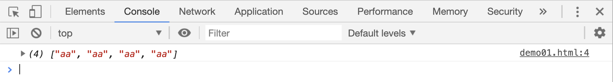
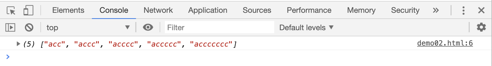
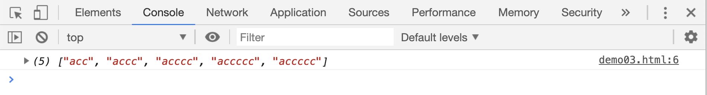
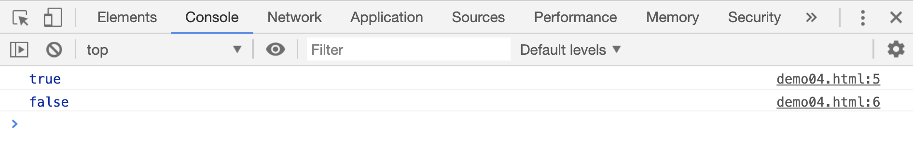
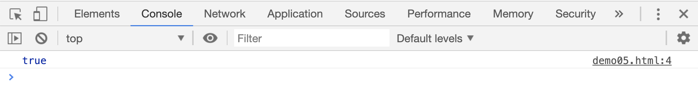
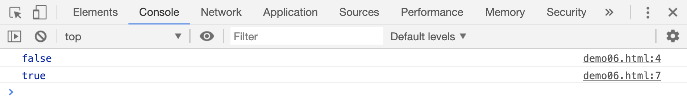
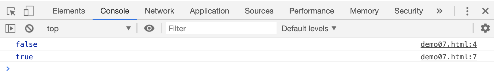
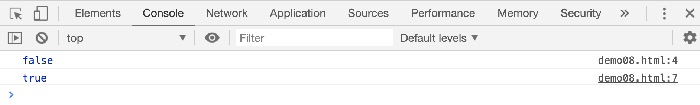
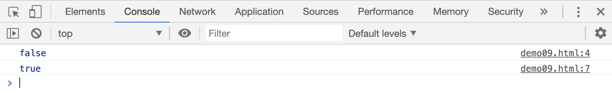

# 正则表达式 2

有一些字符如果出现在`pattern`部分，会带有特殊的含义，所以在使用的时候要千万小心，比如：

## `{}`符号

`{}`符号在正则表达式中，用来指定前面内容连续出现的次数

```html
<script>
    var res;
    res = "a aa aaa aaaa".match(/a{2}/g);
    console.log(res);
</script>
```

[案例源码](./demo/demo01.html)



> 从结果中可以看到，`match` 方法把所有的连续 2 个 `a` 的字符全部都查找出来了

`{}`还有一种用法: `[m,]`，用来表示前一个字符的数量至少要出现`m`次,才能被匹配到

```html
<script>
    var res;
    res = "li ac ly acc lei accc yang acccc wang accccc ling accccccc".match(
        /ac{2,}/g,
    );
    console.log(res);
</script>
```

[案例源码](./demo/demo02.html)



> 上面案例中没有匹配到`ac`，是因为它里面只有一个`c`，而正则中要求至少出现 2 次`c`才可以被匹配到

`[m,n]`则表示前一个字符的数量至少出现`m`次，顶多出现`n`次，才能被匹配到：

```html
<script>
    var res;
    res = "li ac ly acc lei accc yang acccc wang accccc ling accccccc".match(
        /ac{2,5}/g,
    );
    console.log(res);
</script>
```

[案例源码](./demo/demo03.html)



> 上面案例中，正则表达式要求字符`c`至少出现 2 次，最多不超过 5 次才能被匹配到。所以`ac`和`acccccc`不在返回的数组中。

## `[]`符号

`[]`符号在正则表达式中，表示一个字符集合，用来判断目标是否包含`[]`中的任意字符

```html
<script>
    // 判断字符串中是否包含'a', 'b', 'c', 'd'四个之间的任意字符;
    var reg;
    reg = /[abcd]/;
    console.log(reg.test("welcome"));
    console.log(reg.test("lily"));
</script>
```

[案例源码](./demo/demo04.html)



如果想判断目标中是否包含任意一个数字，可以这么写：

```html
<script>
    var res;
    res = /[0-9]/g.test("welcome 10");
    console.log(res);
</script>
```

[案例源码](./demo/demo05.html)



结合前面的`{}`，如果想判断目标中是否包含至少 3 个数字，可以这么写：

```html
<script>
    var res;
    res = /[0-9]{3}/g.test("welcome 10");
    console.log('/[0-9]/g.test("welcome 10"): ', res);

    res = /[0-9]{3}/g.test("welcome 1017");
    console.log('/[0-9]/g.test("welcome 1017"): ', res);
</script>
```

[案例源码](./demo/demo06.html)



如果想判断目标中是否包含任意一个小写字母，可以这么写：

```html
<script>
    var res;
    res = /[a-z]/g.test("101");
    console.log(res);

    res = /[a-z]/g.test("welcome 1017");
    console.log(res);
</script>
```

[案例源码](./demo/demo07.html)



如果想判断目标中是否包含任意 1 个大写字母，可以这么写：

```html
<script>
    var res;
    res = /[A-Z]/g.test("welcome");
    console.log(res);

    res = /[A-Z]/g.test("welcome to China");
    console.log(res);
</script>
```

[案例源码](./demo/demo08.html)



如果想判断目标中是否包含任意 1 个大写字母或者小写字母或者数字，可这么写：

```html
<script>
    var res;
    res = /[a-zA-Z0-9]/g.test(".-|[]");
    console.log(res);

    res = /[a-zA-Z0-9]/g.test("China v5");
    console.log(res);
</script>
```

[案例源码](./demo/demo09.html)



如果想判断目标中，是否包含'b','0','-'中的任意一个字符，可以这么写：

```html
<script>
    var res;
    res = /[b0-]/g.test(".|[]");
    console.log(res);

    res = /[b0-]/g.test("China v50");
    console.log(res);
</script>
```

[案例源码](./demo/demo10.html)


