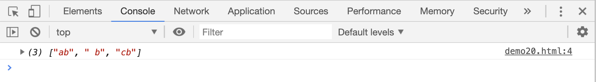
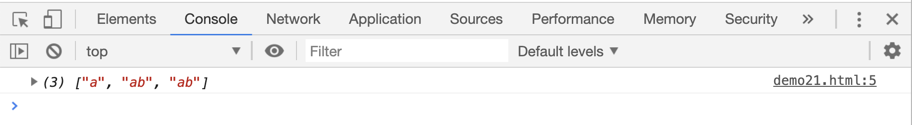
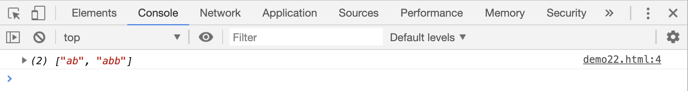
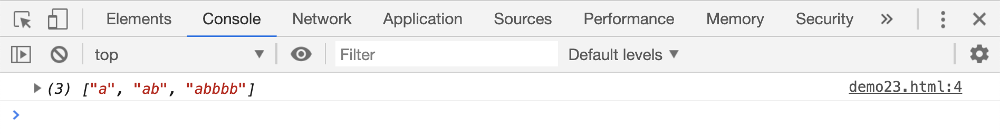

# 正则表达式 2

## `.`符号

`.`在正则表达式中相当于 `[^\n]`,表示换行符之外的任意一个字符

```html
<script>
    var res;
    res = "b ab b cb \nb".match(/.b/g);
    console.log(res);
</script>
```

[案例源码](./demo/demo01.html)



## `?`、`+`和`*`

`?`在正则表达式中相当于`{0,1}`，表示前一个字符可有可无，要么没有，要么只出现 1 次

```html
<script>
    var res;
    res = /ab?/.test("a");
    res = "a ab abb".match(/ab?/g);
    console.log(res);
</script>
```

[案例源码](./demo/demo02.html)



`+`在正则表达式中相当于`{1,}`，表示前一个字符至少出现 1 次，或连续出现多次

```html
<script>
    var res;
    res = "a ab abb".match(/ab+/g);
    console.log(res);
</script>
```

[案例源码](./demo/demo03.html)



`*`在正则表达式中相当于`{0,}`，表示前面的字符没有，或连续出现多次

```html
<script>
    var res;
    res = "a ab abbbb".match(/ab*/g);
    console.log(res);
</script>
```

[案例源码](./demo/demo04.html)


