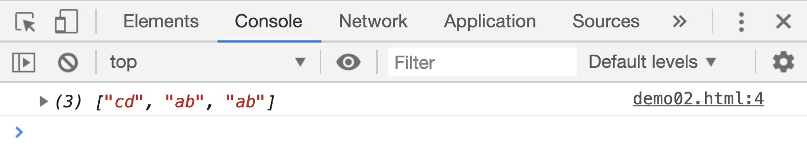
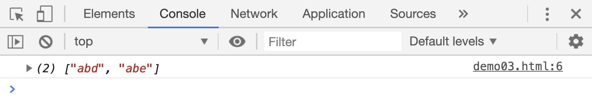

# 正则表达式 3

## `|`符号

`|`符号，在正则表达式对象中表示`或`的意思。前面讲过单独一个字符在正则表达式中都会占据一个位置

```html
<script>
    var res;

    res = "abcd".match(/abcd/g);
    console.log(res);
</script>
```

[案例源码](./demo/demo01.html)


上面代码的匹配项是完整的`abcd`，如果在`b`和`c`之前添加一个`|`，意思就不同了，`ab`和`cd`将作为一个整体去匹配，表示判断字符串中是否包含字符`ab`或者字符`cd`:

```html
<script>
    var res;
    res = "abcd".match(/ab|cd/g);
    console.log(res);
</script>
```

[案例源码](./demo/demo02.html)



所以`|`通常情况下会放在`[]`中使用，比如：

```html
<script>
    var res;

    // 判断字符串中是是否有字符ab，且后面紧跟着一个d或者e字符：
    res = "abc abd abe".match(/ab[d|e]/g);
    console.log(res);
</script>
```

[案例源码](./demo/demo03.html)



## `()`、`\数字`和`$数字`符号

`()`符号用来记住匹配内容，且可以在后续过程中利用`\数字`的方式使用前面匹配的内容，比如使用正则表达式来匹配中文的“叠词”：

```html
<script>
    var res;
    // 匹配AABB类型的叠词
    res = "aabb abac".match(/(.{1})\1(.{1})\2/g);
    console.log(res);

    // 匹配ABAC类型的叠词
    res = "aabb abac".match(/(.{1}).\1./g);
    console.log(res);
</script>
```

[案例源码](./demo/demo04.html)


> 可以自己试试匹配`ABCABC`叠词的正则表达式

使用`()`记住的匹配内容还可以在`replace()`方法中大展身手，`replace()`的第二个参数中可以利用`$数字`的方式使用被记住的内容，比如：

```html
<script>
    var res;
    res = "18516081294".replace(/(185)(1608)/g, "$1-$2-");
    console.log(res);
</script>
```

[案例源码](./demo/demo05.html)


再来看一个之前的 demo[案例](./demo/demo06.html)，如何把代码中的`console.log(date.getFullYear())`格式语句改成`console.log('date.getFullYear(): ', date.getFullYear());`的格式

## `(?:字符)`符号

`(?:字符)`在正则表达式对象中，表示“非捕获匹配”。比如说`/fo{1,2}/`，表示字符`f`后面出现 1 次或者连续 2 次字符`o`:

```html
<script>
    var res;
    res = "f fo foo fooo".match(/fo{1,2}/g);
    console.log(res);
</script>
```

[案例源码](./demo/demo07.html)


但是如果把正则表达式改为`/(?:fo){1,2}/g`，就表示字符`fo`连续出现 2 次。`fo`好被作为一个整体计算出现的次数。

```html
<script>
    var res;
    res = "f fo foo fofo fofoo".match(/(?:fo){1,2}/g);
    console.log(res);
</script>
```

[案例源码](./demo/demo08.html)


> 注意：非捕获匹配中“非捕获”的意思是：这个括号内的字符不会被记住，也就是说不能利用`\数字`或者`$数字`的方式使用括号内匹配的内容。

```html
<script>
    var res;
    res = "fo".replace(/(?:fo){1,2}/g, "$1-");
    console.log(res);
</script>
```

[案例源码](./demo/demo09.html)


这个例子中的`$1`就被当做一个普通字符替换了`fo`。
