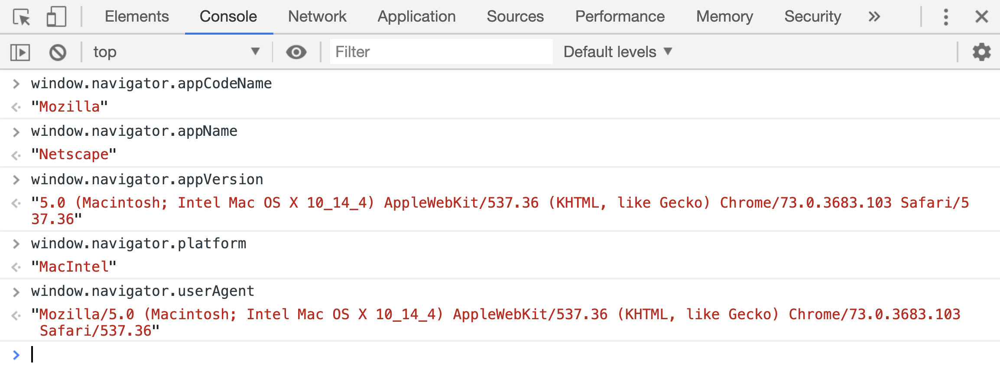

# navigator 对象

浏览器提供了`navigator`接口，用来获取当前浏览器的版本信息，该接口有以下属性

| 属性                  | 作用                                   |
| --------------------- | -------------------------------------- |
| navigator.appCodeName | 获取浏览器的代码名                     |
| navigator.appName     | 获取浏览器的名称                       |
| navigator.appVersion  | 获取浏览器的平台和版本信息             |
| navigator.appPlatform | 获取浏览器的操作系统平台               |
| navigator.userAgent   | 获取浏览器给服务器发送信息时的头部信息 |



这些属性中，最常用的属性就是`userAgent`属性了。工作中经常会通过这个属性判断用户的设备类型，比如判断用户是在电脑上，还是手机上使用浏览器。

```html
<script>
    var userAgent = window.navigator.userAgent.toLowerCase();

    document.write(userAgent + "<br/>");

    if (/android/g.test(userAgent)) {
        document.write("您正在使用的是安卓手机");
    }

    if (/iphone/g.test(userAgent)) {
        document.write("您正在使用的是苹果手机");
    }

    if (/mac/g.test(userAgent)) {
        document.write("您正在使用的是苹果系统的电脑");
    }

    if (/window/g.test(userAgent)) {
        document.write("您正在使用的是window系统的电脑");
    }
</script>
```

[案例源码](./demo/demo02.html)


