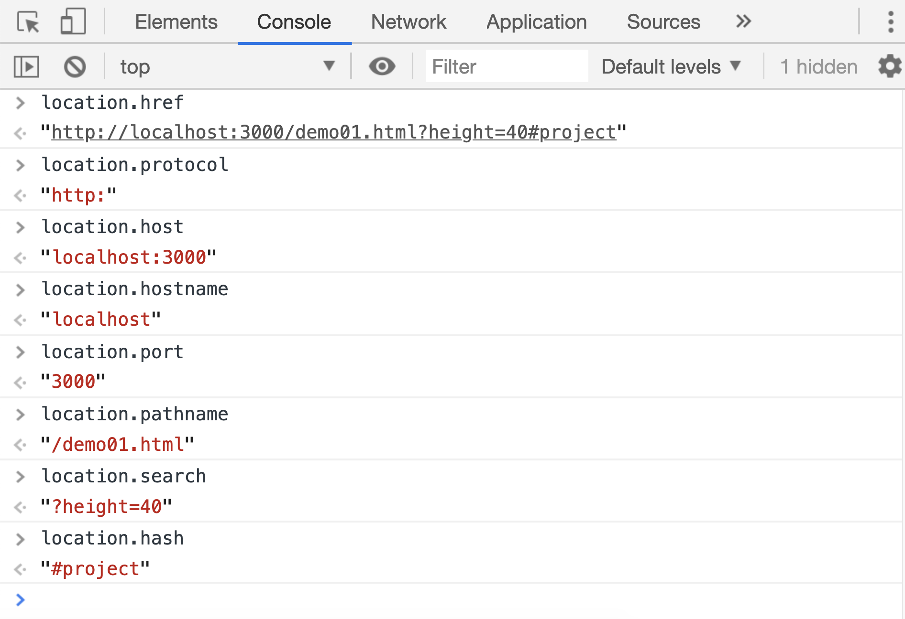

# location 对象

浏览器提供了一个`location`接口，用来操作浏览器的地址栏。

| 属性/方法      | 作用                                  |
| -------------- | ------------------------------------- |
| `href`         | 设置或获取 当前窗口完整的 url         |
| `protocol`     | 设置或获取 url 中的协议               |
| `host`         | 设置或获取 url 中的主机名(域名)和端口 |
| `hostname`     | 设置或获取 url 中的主机名(域名)       |
| `pathname`     | 设置或获取 url 中的文件路径           |
| `port`         | 设置或获取 url 中的端口号             |
| `search`       | 设置或获取 url 中的查询部分           |
| `hash`         | 设置或获取 url 的锚点部分             |
| `reload()`     | 重新加载本页面                        |
| `assign(url)`  | 载入一个新页面                        |
| `replace(url)` | 用新页面替换本页面                    |

一个标准的网址规则如下：

```
protocol://hostname:port/pathname?search#hash
协议://域名:端口/文件地址?查询条件#锚点
```

假设当前打开的页面地址是：`http://localhost:3000/demo01.html?height=40#project`，它的各个属性值结果如下：



前面列举的这些属性，即可以获取当前页面的某个部分，又可以修改当前页面中 url 的某个部分，但是修改之后浏览器的行为是不同的，比如：

-   `href protocol host hostname port pathname`这些属性修改之后，如果修改后的值和原先的值不同，会会导致浏览器跳转到其他页面，如果修改后的值和原先值相同，则浏览器不会有任何行为
-   `search`属性被修改后，会导致浏览器刷新本页面
-   `hash`属性被修改后，浏览器会自动滚动到对应的锚点位置

## assign() 和 replace()

除了通过前面的一些属性可以达到跳转页面的目的之外，`locaiton`还提供了两种方法用来跳转页面:`location.assign(url)`和`location.replace()`。他们两个的区别在于：

-   `location.assign(url)`跳转的页面，可通过回退按钮返回上一个页面
-   `location.replace(url)`跳转的页面，不可以回退按钮返回上一个页面
