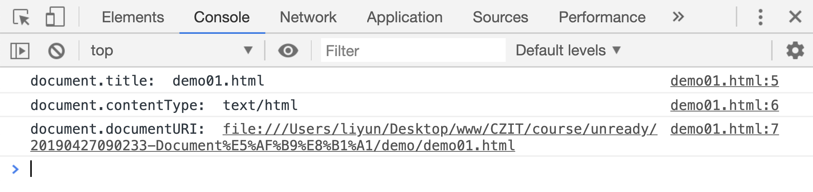

# Document 对象

`document`（在浏览器中用 DOM 表示）是载入窗口的实际页面，在 JavaScript 中用 Document 对象表示，你可以用这个对象来返回和操作文档中 HTML 和 CSS 上的信息。例如获取 DOM 中一个元素的引用，修改其文本内容，并应用新的样式，创建新的元素并添加为当前元素的子元素，甚至把他们一起删除。

通过 document 获取当前页面的一些信息：

| 属性                   | 作用                               |
| ---------------------- | ---------------------------------- |
| `document.title`       | 获取当前页面的标题                 |
| `document.documentURI` | 获取当前页面的 URI 地址            |
| `document.contenType`  | 获取当前页面的`content-type`属性值 |

```html
<head>
    <title>demo01.html</title>
</head>
<script>
    console.log("document.title: ", document.title);
    console.log("document.contentType: ", document.contentType);
    console.log("document.documentURI: ", document.documentURI);
</script>
```

[案例源码](./demo/dem01.html)



通过`document`获取页面上的指定类型元素：

| 属性/方法                  | 作用                    |
| -------------------------- | ----------------------- |
| `document.documentElement` | 获取 `html` 元素        |
| `document.head`            | 获取 `head` 元素        |
| `document.body`            | 获取 `body` 元素        |
| `document.scripts`         | 返回所有的`scripts`元素 |
| `document.links`           | 返回所有的超链接元素    |
| `document.images`          | 返回所有的`img`元素     |
| `document.forms`           | 返回所有的`form`元素    |

通过其他方式获取元素

| 方法                                         | 作用                                                        |
| -------------------------------------------- | ----------------------------------------------------------- |
| `document.getElementById(id)`                | 通过`id`属性值查找元素，返回该元素                          |
| `document.getElementsByName(name)`           | 通过元素的 name 属性值查找元素，返回**所有**符合条件的元素  |
| `document.getElementsByTagName(tagName)`     | 通过元素的标签名查找元素，返回**所有**符合条件的元素        |
| `document.getElementsByClassName(className)` | 通过元素的 class 属性值查找元素，返回**所有**符合条件的元素 |
| `document.querySelector(cssSelector)`        | 通过 css 选择器查找元素，返回**第 1 个**符合条件的元素      |
| `document.querySelectorAll(cssSelector)`     | 通过 css 选择器查找元素，返回**所有**符合条件的元素         |

## createElement()

document 除了获取先要的元素之外，还可以创建一个新的元素。创建的新元素可以被插入到当前文档的指定位置中去。

```html
<!-- 这段代码会在页面中插入一个input输入框 -->
<script>
    var ele = document.createElement("input");
    document.body.append(ele);
</script>
```
