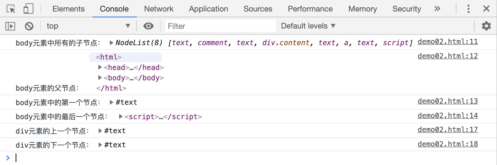
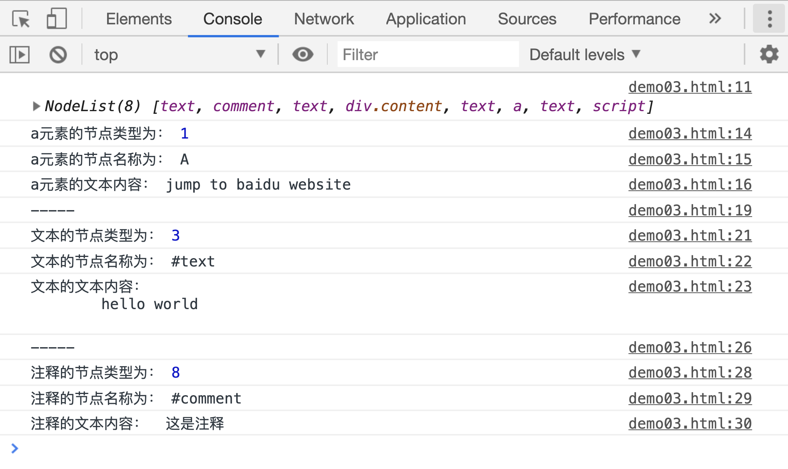
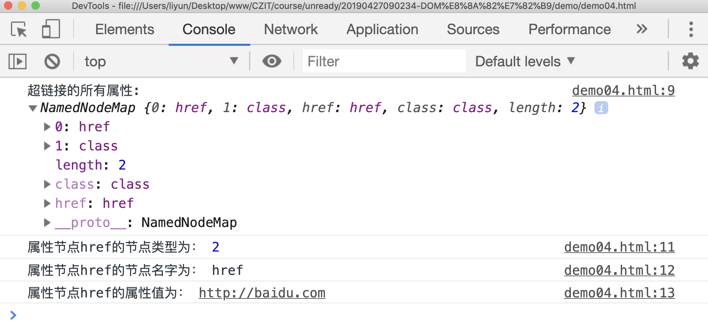
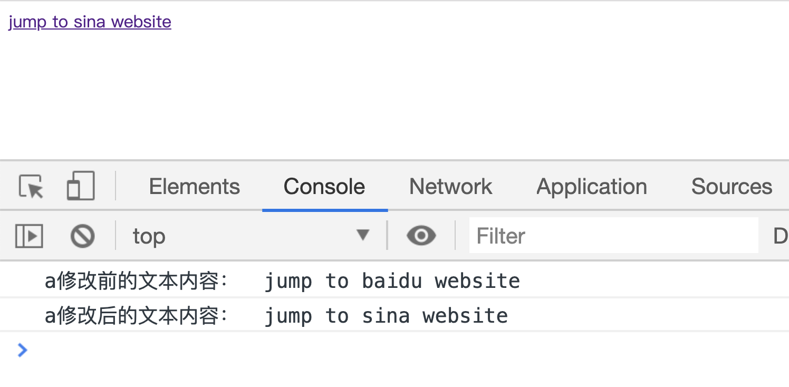
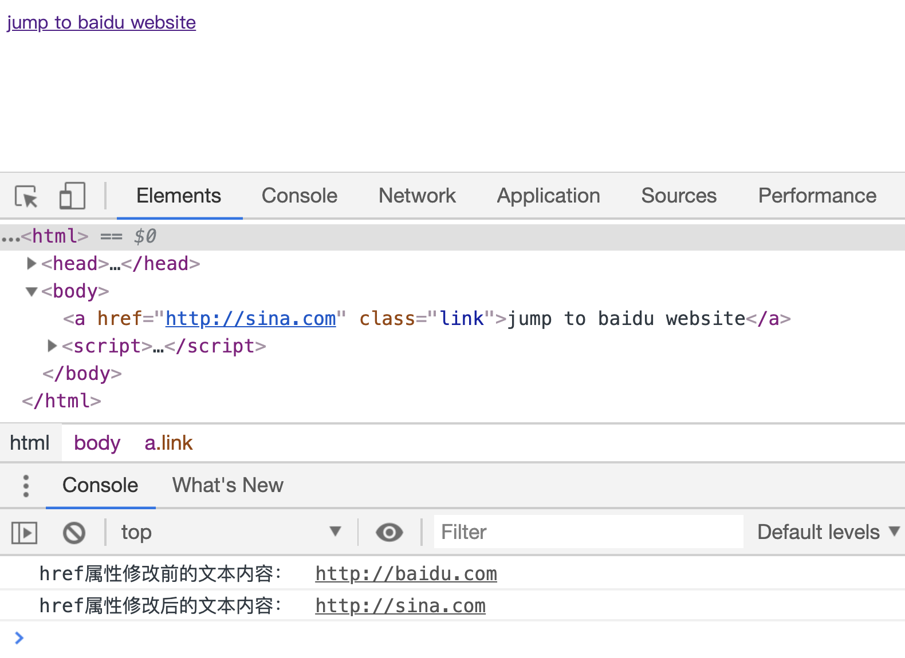

# DOM 节点

网页在加载之前会自动把从服务器获取的 html 文件转成一个节点树，比如下面这段 html 代码：

```html
<html>
    <head>
        <title>new document</title>
    </head>
    <body>
        <!-- 这是注释 -->
        <div class="content">we are family</div>
        <a href="http://baidu.com">jump to baidu website</a>
    </body>
</html>
```

被转成节点树是酱紫的：

```
document
    |--html
        |--head
        |  |--#text
        |  |--title
        |  |  |--#text: new document
        |  |--#text
        |--#text:
        |--body
            |--#text
            |--#comment: 这是注释
            |--#text
            |--div class: content
            |  |--#text: we are family
            |--#text
            |--a href: http://baidu.com
            |  |--#text: jump to baidu.com
            |--#text
```

`html`是最基本的节点，`head/body/div/a`叫做**元素节点**， `#text`叫做**文本节点**；`#comment`叫做**注释节点**，从 head 和 body 元素开始，相邻的**非文本节点**之间会有一个空白的文本节点，父元素和第一个及最后一个**非文本子节点**之间也会有一个空白的文本节点。

> 元素是节点的一种，元素一定是节点，节点不一定是元素！

> 如果想查询 html 文档生成的节点树，可以通过在线工具[live-dom-viewer](https://software.hixie.ch/utilities/js/live-dom-viewer/)转成节点树。

JS 引擎为这些节点提供了一些属性和方法，用来查找想要的节点或者操作某个节点，先来看看**查找节点**的一些属性或方法：

| 属性/方法         | 作用                                               |
| ----------------- | -------------------------------------------------- |
| `childNodes`      | 获取当前节点包含的所有节点，返回一个 NodeList 对象 |
| `parentNode`      | 获取当前节点的父节点                               |
| `firstChild`      | 获取当前节点包含的第一个子节点 ，没有返回`null`    |
| `lastChild`       | 获取当前节点包含的最后一个子节点，没有返回`null`   |
| `previousSibling` | 获取当前节点的前一个兄弟节点                       |
| `nextSibling`     | 获取当前节点的后一个兄弟节点                       |

```html
<html>
    <head>
        <title>new document</title>
    </head>
    <body>
        <!-- 这是注释 -->

        <div class="content">we are family</div>
        <a href="http://baidu.com">jump to baidu website</a>
        <script>
            var ele = document.body;
            console.log("body元素中所有的子节点：", ele.childNodes);
            console.log("body元素的父节点：", ele.parentNode);
            console.log("body元素中的第一个节点：", ele.firstChild);
            console.log("body元素中的最后一个节点：", ele.lastChild);

            var div = document.querySelector("div");
            console.log("div元素的上一个节点：", div.previousSibling);
            console.log("div元素的下一个节点：", div.nextSibling);
        </script>
    </body>
</html>
```

[案例源码](./demo/dem02.html)



1. 这里`document.body`用来获取`body`元素，前面说过**元素也是一种节点**，所以可以直接使用节点的`childNodes`属性。
2. 前面说过**父元素和第一个及最后一个非文本子节点之间也会有一个空白的文本节点**，既然这样 body 的最后一个节点不是一个空白文字节点吗？这就和`html`的加载和执行顺序有关了: 在这段 JS 执行的时候，`body`中插入的最后一个节点是 `script` 元素本身，只有在 JS 执行完成后，才插入 `script` 与 `body`之间的空白文本节点。
3. 返回的 `NodeList` 对象，是一个**类数组对象**，不是一个真正的数组，另外从上面的图中可以看出，这个 `NodeList` 对象中有一个属性`length`,也就是说可以通过`length`属性获取子节点的数量。

## 节点类型

拿到节点以后，可以通过以下属性，获取节点的类型、名称、文本内容：

| 属性          | 作用                           |
| ------------- | ------------------------------ |
| `nodeType`    | 获取节点的类型                 |
| `nodeName`    | 获取普通节点或者属性节点的名称 |
| `textContent` | 获取节点的文本内容             |

```htm
<html>
    <head>
        <title>new document</title>
    </head>
    <body>
        <!-- 这是注释 -->
        hello world
        <div class="content">we are family</div>
        <a href="http://baidu.com">jump to baidu website</a>
        <script>
            console.log(document.body.childNodes);
            // 元素节点的节点类型标识符是1，nodeName是标签名，textContent是元素的所有文字内容
            var ele = document.querySelector("a");
            console.log("a元素的节点类型为：", ele.nodeType);
            console.log("a元素的节点名称为：", ele.nodeName);
            console.log("a元素的文本内容：", ele.textContent);

            // 文本节点的节点类型标识符是3，nodeName是#text ， textContent是文本内容
            console.log("-----");
            ele = document.body.childNodes[2];
            console.log("文本的节点类型为：", ele.nodeType);
            console.log("文本的节点名称为：", ele.nodeName);
            console.log("文本的文本内容：", ele.textContent);

            // 注释节点的类型标识符是8，nodeName是#comment，textContent是注释内容
            console.log("-----");
            ele = document.body.childNodes[1];
            console.log("注释的节点类型为：", ele.nodeType);
            console.log("注释的节点名称为：", ele.nodeName);
            console.log("注释的文本内容：", ele.textContent);
        </script>
    </body>
</html>
```

[案例源码](./demo/dem03.html)



## 属性节点

> 注意属性节点的常量`Node.ATTRIBUE_NODE`常量已被废弃，不建议使用这种方式获取元素的属性值

html 中使用`attributes`获取到元素的所有属性，这个属性对象中包含了该元素的多个**属性节点**。属性节点也有它自己的`nodeType、nodeName、textContent`属性,

```html
<html>
    <head>
        <title>new document</title>
    </head>
    <body>
        <a href="http://baidu.com" class="link">jump to baidu website</a>
        <script>
            var ele = document.querySelector("a");
            console.log("超链接的所有属性: ", ele.attributes);
            var attrs = ele.attributes;
            console.log("属性节点href的节点类型为：", attrs.href.nodeType);
            console.log("属性节点href的节点名字为：", attrs.href.nodeName);
            console.log("属性节点href的属性值为：", attrs.href.textContent);
        </script>
    </body>
</html>
```

[案例源码](./demo/dem04.html)



## 修改节点的文本内容

`textContent`即可以获取节点的文本内容，还可以修改节点的文本内容：

```html
<html>
    <head>
        <title>new document</title>
    </head>
    <body>
        <a href="http://baidu.com" class="link">jump to baidu website</a>
        <script>
            var ele = document.querySelector("a");
            console.log("a修改前的文本内容： ", ele.textContent);

            ele.textContent = "jump to sina website";
            console.log("a修改后的文本内容： ", ele.textContent);
        </script>
    </body>
</html>
```

[案例源码](./demo/dem05.html)



> 如果想修改超链接`href`的文本内容，也可以借助`textContent`去修改，但是这个方法**不被推荐使用**，后面会讲一组专门用来获取、修改元素属性和属性值的方法。这里简单写一下怎么用`textContent`修改元素某个属性的值。

```html
<html>
    <head>
        <title>new document</title>
    </head>
    <body>
        <a href="http://baidu.com" class="link">jump to baidu website</a>
        <script>
            var ele = document.querySelector("a");
            var hrefAttr = ele.attributes.href;
            console.log("href属性修改前的文本内容： ", hrefAttr.textContent);

            hrefAttr.textContent = "http://sina.com";
            console.log("href属性修改后的文本内容： ", hrefAttr.textContent);
        </script>
    </body>
</html>
```

[案例源码](./demo/dem06.html)


