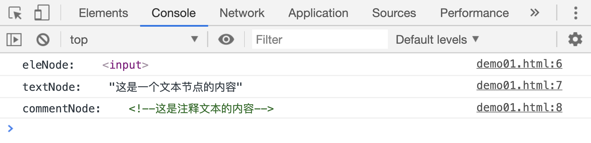
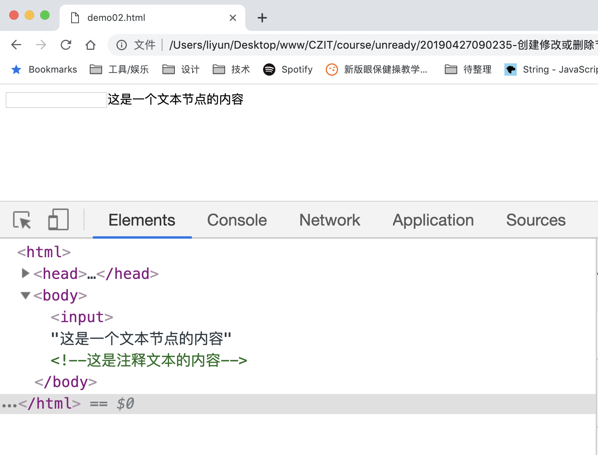
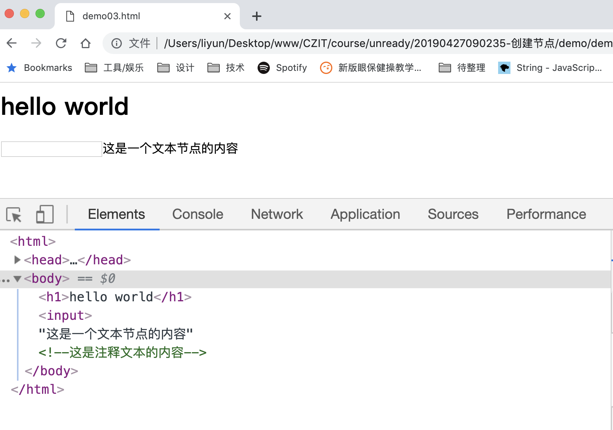
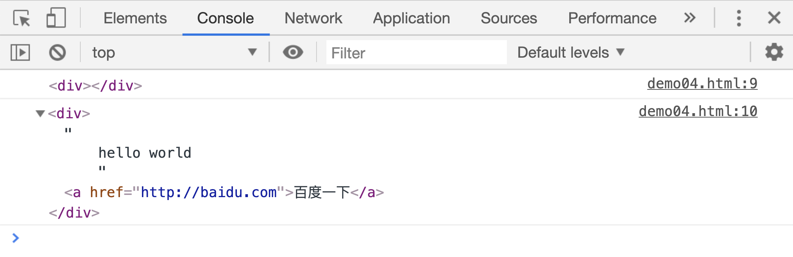
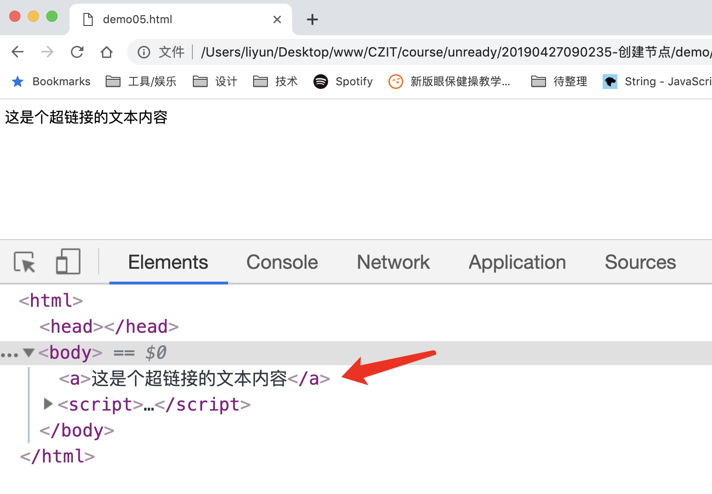
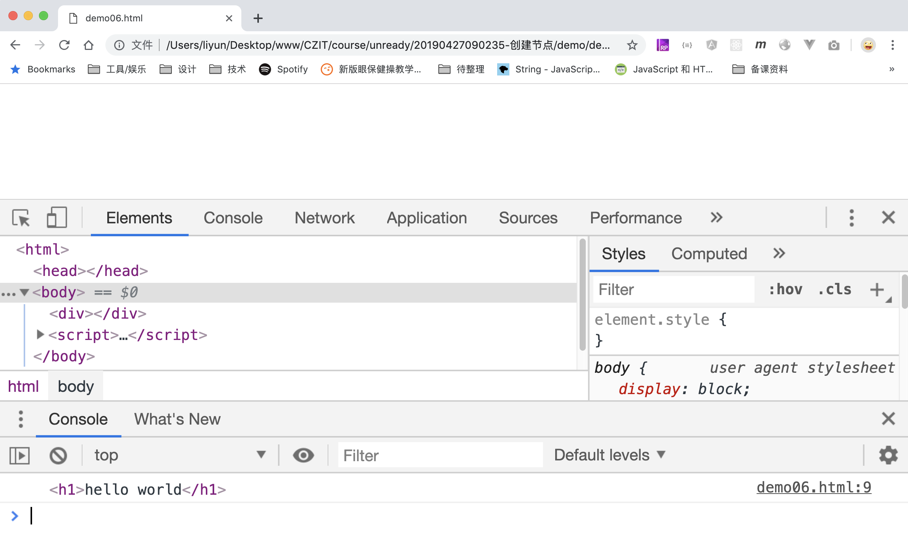
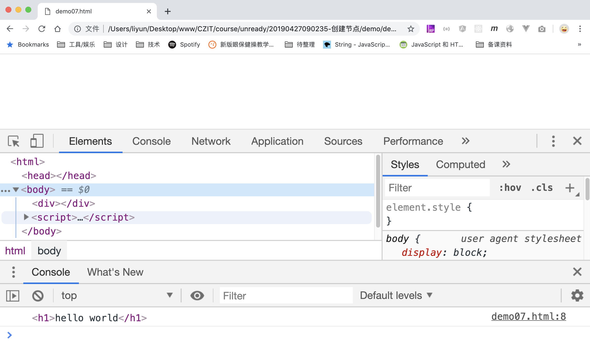
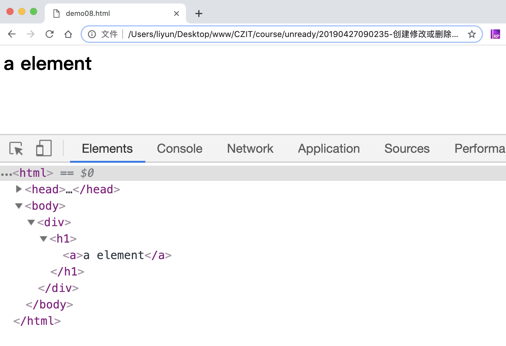

# 创建修改或删除节点

javascript 提供了一些方法用于创建、插入、修改和删除节点，比如：

| 方法                                         | 作用                                                           |
| -------------------------------------------- | -------------------------------------------------------------- |
| `document.createElement(tagName)`            | 创建一个元素节点                                               |
| `document.createTextNode(data)`              | 创建一个文本节点                                               |
| `document.createComment(data)`               | 创建一个注释节点                                               |
| `document.createDocumentFragment()`          | 创建一个空的文档片段                                           |
| `parentNode.appendChild(newNode)`            | 在父节点中往后插入一个新节点                                   |
| `parentNode.insertBefore(newNode, nextNode)` | 在父节点中插入一个新节点，并让新节点插入到指定节点的前一个位置 |
| `node.cloneNode([deep])`                     | 复制节点 node，返回复制的节点                                  |
| `parentNode.replaceChild(newNode, oldNode)`  | 用新节点替换旧节点                                             |
| `parentNode.remove(childNode)`               | 删除父节点中指定的子节点                                       |

`document.createElement(tagName)、document.createTextNode(data)、document.createComment(data)`三个方法都返回新创建的节点：

```html
<script>
    var eleNode = document.createElement("input");
    var textNode = document.createTextNode("这是一个文本节点的内容");
    var commentNode = document.createComment("这是注释文本的内容");

    console.log(eleNode);
    console.log(textNode);
    console.log(commentNode);
</script>
```

[案例源码](./demo/dem01.html)



## appendChild()和 insertBefore()

现在可以使用`appendChild()`方法把他们都依次插入到`body`元素中去：

```html
<script>
    var eleNode = document.createElement("input");
    var textNode = document.createTextNode("这是一个文本节点的内容");
    var commentNode = document.createComment("这是注释文本的内容");

    // window.onload 表示当整个页面加载完成后，再执行后面函数中的语句
    window.onload = function() {
        document.body.appendChild(eleNode);
        document.body.appendChild(textNode);
        document.body.appendChild(commentNode);
    };
</script>
```

[案例源码](./demo/dem02.html)



此时，如果想在`input`元素的前面插入一个`h1`元素，可以这么写：

```html
<script>
    var eleNode = document.createElement("input");
    var textNode = document.createTextNode("这是一个文本节点的内容");
    var commentNode = document.createComment("这是注释文本的内容");

    // window.onload 表示当整个页面加载完成后，再执行后面函数中的语句
    window.onload = function() {
        document.body.appendChild(eleNode);
        document.body.appendChild(textNode);
        document.body.appendChild(commentNode);

        var h1Ele = document.createElement("h1");
        h1Ele.textContent = "hello world";
        document.body.insertBefore(h1Ele, eleNode);
    };
</script>
```

[案例源码](./demo/dem03.html)



> 千万注意一点，上面两个案例，我们都是插入了一个新创建的元素，如果插入的是一个从页面中获取的元素，该元素会被从原有位置删除，再插入到新的位置，类似于电脑中的**剪切**功能；

## cloneNode()

`closeNode([deep])`在使用的时候要注意里面的参数`deep`，`deep` 用来告诉 JS 引擎，是否同时拷贝节点的子节点。`true`表示同时拷贝节点中的所有子节点，`false`表示之拷贝节点本身，`deep` 默认是`false`：

```html
<div>
    hello world
    <a href="http://baidu.com">百度一下</a>
</div>

<script>
    window.onload = function() {
        var divEle = document.querySelector("div");
        console.log(divEle.cloneNode());
        console.log(divEle.cloneNode(true));
    };
</script>
```

[案例源码](./demo/dem04.html)



从图中可以看出，没有传入参数时，克隆出来的只是一个空的元素节点，参数设为`true`时，返回的结果包含了`div`元素的所有子节点。

## replaceNode()

`parentNode.replaceChild(newNode, oldNode)`可以用新节点替换父节点中指定的子节点：

```html
<h1>hello world</h1>
<script>
    window.onload = function() {
        var h1Ele = document.querySelector("h1");
        var newNode = document.createElement("a");
        newNode.textContent = "这是个超链接的文本内容";
        document.body.replaceChild(newNode, h1Ele);
    };
</script>
```

[案例源码](./demo/dem05.html)



## removeChild()

`parentNode.removeChild(childNode)`用于删除父元素下的指定子元素。

```html
<div>
    <h1>hello world</h1>
</div>
<script>
    window.onload = function() {
        var divEle = document.querySelector("div");
        var h1Ele = document.querySelector("h1");
        var res = divEle.removeChild(h1Ele);
        console.log(res);
    };
</script>
```

[案例源码](./demo/dem06.html)



上面我们是通过`h1`元素的父元素`div`元素删除的，能不能通过元素本身删除呢？

```html
<div>
    <h1>hello world</h1>
</div>
<script>
    window.onload = function() {
        var h1Ele = document.querySelector("h1");
        // parentNode :获取元素的父元素
        var res = h1Ele.parentNode.removeChild(h1Ele);
        console.log(res);
    };
</script>
```

[案例源码](./demo/dem07.html)



## createDocumentFragment()

浏览器收到一个 html 文档后，要执行以下操作：

1. 解析 html 构建 DOM**节点树**
2. 解析 CSS 样式，构建**渲染树**
3. 结合节点树和渲染树，从根元素开始，计算每一个节点的大小和应该出现在屏幕中的位置
4. 在页面中把所有元素渲染(显示)出来

在修改页面中某个元素时，如果某个操作导致页面需要重新计算大量元素的大小和应该出现的位置，这个过程叫做**reflow(回流)**。如果只是修改了某些元素的样式，比如修改了元素的颜色，大小等，会导致页面重新去渲染这个元素，这个过程叫做**repaint(重绘)**。

从步骤中可以看出，回流发生在第三步，重绘发生在第四步。如果某个操作导致页面回流，将会消耗大量的内存资源。所以在修改元素时，要尽量避免回流，或者减少页面回流的次数。

比如我们想往页面中插入如下元素：

```html
<div>
    <h1>
        <a href="http://baidu.com">a element</a>
    </h1>
</div>
```

按照普通的思路应该是这样子的：

```html
<script>
    window.onload = function() {
        var div = document.createElement("div");
        document.body.appendChild(div);
        var h1 = document.createElement("h1");
        div.append(h1);
        var a = document.createElement("a");
        h1.appendChild(a);
        a.textContent = "a element";
    };
</script>
```

这么写目的是实现了，但是浏览器连续执行了 3 次插入节点的操作，每次插入新的节点，都会导致回流事件发生一次，对内存的浪费太严重了。此时就该`document.createDocumentFragment()`方法上场了。

`document.createDocumentFragment()`会创建一个空白片段，这个片段会暂时保存在内存中，先把所有想插入的节点放到这个空白片段中，再一次性插入到页面中去，虽然也会引起回流，但只会回流 1 次：

```html
<script>
    window.onload = function() {
        /*
        这种方式会引起多次回流，不推荐使用
        var div = document.createElement("div");
        document.body.appendChild(div);
        var h1 = document.createElement("h1");
        div.append(h1);
        var a = document.createElement("a");
        h1.appendChild(a);
        a.textContent = "a element";
        */

        var ele = document.createDocumentFragment();
        var div = document.createElement("div");
        var h1 = document.createElement("h1");
        var a = document.createElement("a");
        a.textContent = "a element";
        ele.appendChild(div);
        div.appendChild(h1);
        h1.appendChild(a);

        document.body.appendChild(ele);
    };
</script>
```

[案例源码](./demo/dem08.html)


