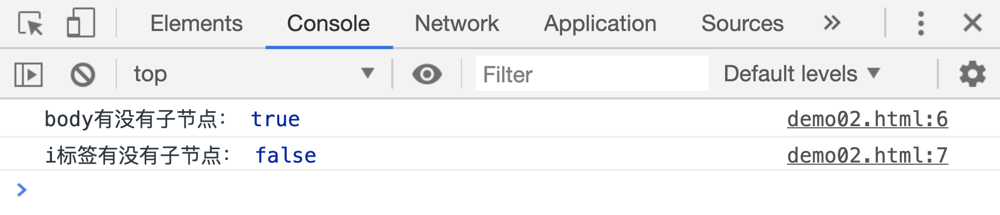

# 检查节点

关于节点，还有三个函数属性：

| 属性                         | 作用                           |
| ---------------------------- | ------------------------------ |
| `node.isConnected`           | 判断节点是否在当前页面中       |
| `parentNode.hasChildNodes()` | 判断节点是否有子节点           |
| `parentNode.contains(node)`  | 判断节点是否是另一个节点的后代 |
| `node1.isEqualNode(node2)`   | 判断两个节点是否完全相同       |

## node.isConnected

新创建的元素在插入页面之前，它和当前文档之前是没有联系的，此时这个元素节点的`isConnected`属性值就是`false`。

```html
<h1>hello world</h1>
<script>
    var ele = document.createElement("input");
    console.log("新创建的元素：", ele.isConnected);

    var h1 = document.querySelector("h1");
    console.log("页面中已有元素：", h1.isConnected);
</script>
```

[案例源码](./demo/dem01.html)


## parentNode.hasChildNodes()

这个方法用来判断当前节点是否包含有子节点，有则返回`true`，没有返回`false`

```html
<div>
    <a href="http://baidu.com">jump to baidu website</a>
    <i></i>
</div>
<script>
    console.log("body有没有子节点：", document.body.hasChildNodes());
    console.log(
        "i标签有没有子节点：",
        document.querySelector("i").hasChildNodes(),
    );
</script>
```

[案例源码](./demo/dem02.html)



## parentNode.contains(node)

这个属性用来判断`node`节点是否是`parentNode`的**后代**节点

```html
<div>
    <a href="http://baidu.com">jump to baidu website</a>
    <i></i>
</div>
<script>
    var div = document.querySelector("div");
    var a = document.querySelector("a");
    console.log(document.body.contains(div));
    console.log(document.body.contains(a));
</script>
```

[案例源码](./demo/dem03.html)


## node1.isEqualNode(node2)

这个方法用来判断 2 个节点是否相同，一般来说如果两个节点的节点类型、节点名、节点内容(后代节点)相同，该方法的返回值就是`true`

```html
<div>
    <a href="http://baidu.com">jump to baidu website</a>
</div>
<div>
    <a href="http://sina.com">jump to sina website</a>
</div>
<div>
    <a href="http://baidu.com">jump to baidu website</a>
</div>
<script>
    var divs = document.querySelectorAll("div");
    console.log(divs[0].isEqualNode(divs[1]));
    console.log(divs[0].isEqualNode(divs[2]));
    console.log(divs[1].isEqualNode(divs[2]));
</script>
```

[案例源码](./demo/dem04.html)


