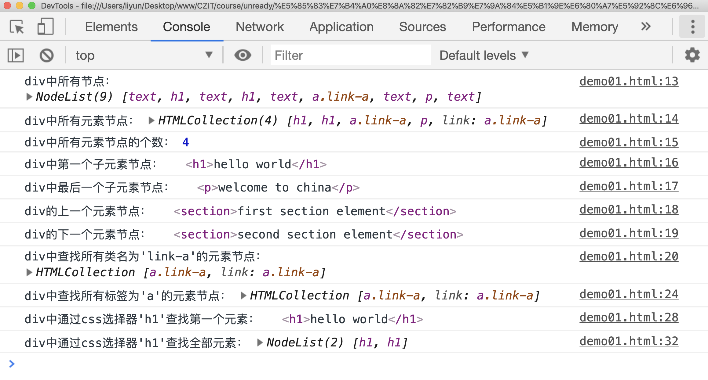

# 元素节点的属性和方法

元素节点也是节点，继承了节点的属性和方法。但是元素节点也有自己的一套独立属性/方法，比如获取一个节点中的元素节点：

| 属性                             | 作用                                     |
| -------------------------------- | ---------------------------------------- |
| `element.children`               | 获取元素节点中所有的**子元素**节点       |
| `element.childElementCount`      | 获取元素节点中所有的**子元素**节点的个数 |
| `element.firstElementChild`      | 获取元素节点中第一个**子元素**节点       |
| `element.lastElementChild`       | 获取元素节点中最后一个**子元素**节点     |
| `element.previousElementSibling` | 获取元素节点的上一个兄弟**元素**节点     |
| `element.nextElementSibling`     | 获取元素节点的下一个兄弟**元素**节点     |

除了这些，还有：

| 属性                                    | 作用                                                               |
| --------------------------------------- | ------------------------------------------------------------------ |
| `element.getElementsByClassName`        | 在后代元素中根据类名查找元素，返回**所有**符合条件的元素           |
| `element.getElementsByTagName`          | 在后代元素中根据标签名查找元素，返回 **所有**符合条件的元素        |
| `element.querySelector(cssSelector)`    | 在后代元素中通过 css 选择器查找元素，返回 **第一个**符合条件的元素 |
| `element.querySelectorAll(cssSelector)` | 在后代元素中通过 css 选择器查找元素，返回 **所有**符合条件的元素   |

> 注意：这里没有`getElementById(id)`方法！

```html
<section>first section element</section>
<div>
    <h1>hello world</h1>
    <h1>hello world</h1>
    <a href="http://baidu.com" target="_blank" name="link" class="link-a"
        >jump to baidu website</a
    >
    <p>welcome to china</p>
</div>
<section>second section element</section>

<script>
    var div = document.querySelector("div");
    console.log("div中所有节点：", div.childNodes);
    console.log("div中所有元素节点：", div.children);
    console.log("div中所有元素节点的个数：", div.childElementCount);
    console.log("div中第一个子元素节点：", div.firstElementChild);
    console.log("div中最后一个子元素节点：", div.lastElementChild);
    console.log("div的上一个元素节点：", div.previousElementSibling);
    console.log("div的下一个元素节点：", div.nextElementSibling);
    console.log(
        "div中查找所有类名为'link-a'的元素节点：",
        div.getElementsByClassName("link-a"),
    );
    console.log(
        "div中查找所有标签为'a'的元素节点：",
        div.getElementsByTagName("a"),
    );
    console.log(
        "div中通过css选择器'h1'查找第一个元素：",
        div.querySelector("h1"),
    );
    console.log(
        "div中通过css选择器'h1'查找全部元素：",
        div.querySelectorAll("h1"),
    );
</script>
```

[案例源码](./demo/dem01.html)



注意：

1. 所有返回一个集合的方法，如果没有找到符合条件的元素，会返回一个空集合；只返回一个元素的方法，如果没有找到符合条件的元素，会返回`null`
2. 以上这些查找元素节点的放大都只适用于查找标准的元素，不能用来查找**伪元素**
