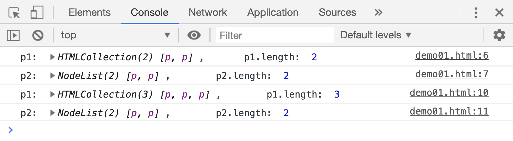

# 获取元素节点两种方式的区别

既然`getXXXByXXX()`和`queryXXX`两种方式都可用来获取元素节点，他们之间肯定是有区别的：

> `getXXXByXXX()`获取到的是一个**动态**的元素集合，`queryXXX`获取到的是一个**静态**的节点集合

```html
<p>hello world</p>
<p>hello world</p>
<script>
    var p1 = document.getElementsByTagName("p");
    var p2 = document.querySelectorAll("p");
    console.log("p1: ", p1, ",       p1.length: ", p1.length);
    console.log("p2: ", p2, ",        p2.length: ", p2.length);

    document.body.append(p1[0].cloneNode(true));
    console.log("p1: ", p1, ",        p1.length: ", p1.length);
    console.log("p2: ", p2, ",        p2.length: ", p2.length);
</script>
```

[案例源码](./demo/dem01.html)



从结果中可以看出来，往页面中插入一个 p 元素的克隆元素后，变量`p1`的结果自动发生了变化，`p2`中结果的数量依然是`2`。

这就是因为`getXXXBYXXX`的方式获取到的元素列表，在使用该列表结果时，JS 引擎会按照当时查找元素的条件**重新查找**一遍。

除此之外，`element.children/chidrenElementCount/firstElementChild/lastElementChild/previousElementSibling/nextElementSibling`属性也属于**动态**属性，它们的返回值在重新使用时，也会自动重查。
