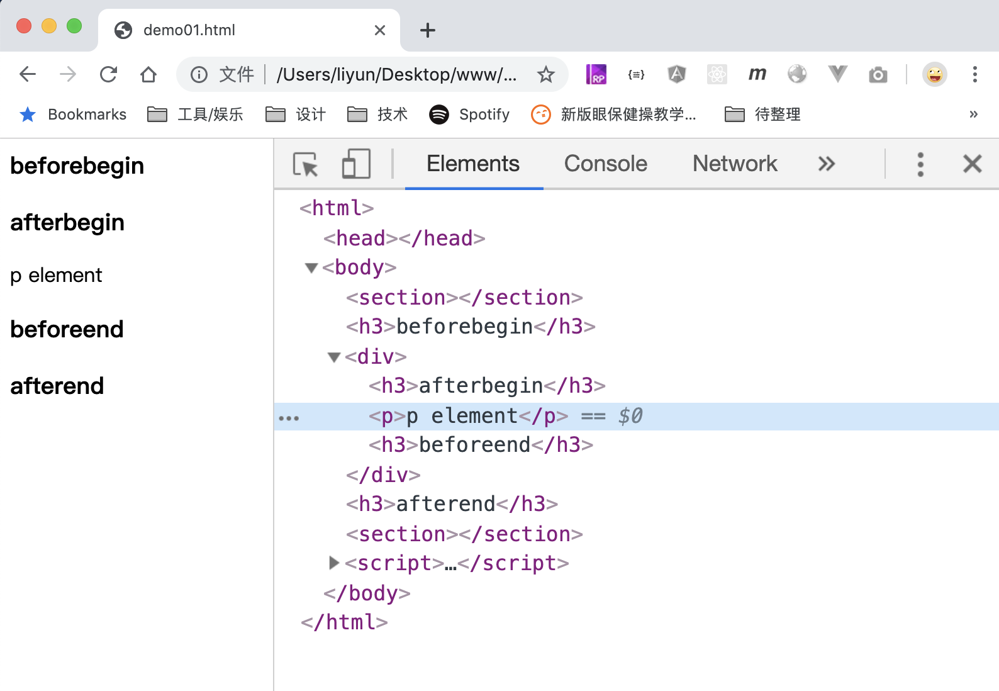
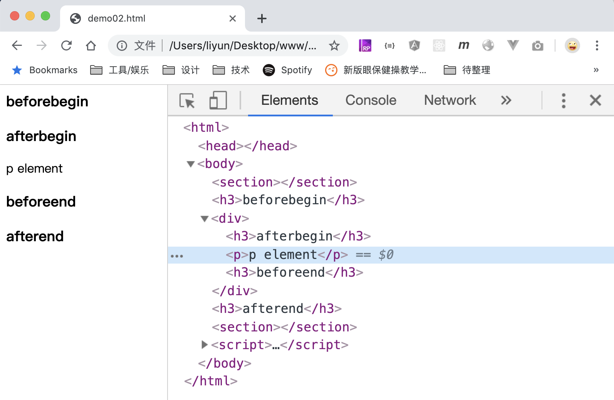
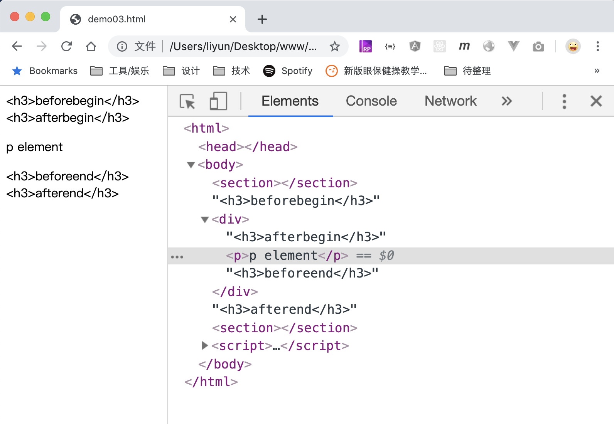

# 往元素中插入内容

前面讲过在节点中插入其他节点的方法，js 也额外提供了 3 中在元素中插入其他元素或者文本的方法：

| 方法                                               | 作用                             |
| -------------------------------------------------- | -------------------------------- |
| `element.insertAdjacentElement(position, element)` | 在元素的指定位置插入新元素       |
| `element.insertAdjacentHTML(position, text)`       | 在元素的指定位置插入新元素       |
| `element.insertAdjacentText(position, text)`       | 在元素的指定位置插入新的文本内容 |

首先说一下这三个函数的`position`参数，这个参数一共只有 4 中值：

| 参数值        | 作用                       |
| ------------- | -------------------------- |
| `beforebegin` | 在元素本身前插入           |
| `afterbegin`  | 在元素第一个子元素前插入   |
| `beforeend`   | 在元素最后一个子元素后插入 |
| `afterend`    | 在元素本身后插入           |

假设我们有以下元素：

```html
<section></section>
<div>
    <p></p>
</div>
<section></section>
```

上面四个参数值的位置分别在：

```html
<section></section>
<!-- beforebegin -->
<div>
    <!-- afterbegin -->
    <p></p>
    <!-- beforeend -->
</div>
<!-- afterend -->
<section></section>
```

这四种值中的`begin`和`end`可以理解为元素的开始和结束标签： 把目标插入开始或者结束标签的前面或者后面；插入到开始标签的前面，就是`befirebegin`，目标会成为元素的前一个兄弟元素；插入到开始标签的后面，就是`afterbegin`，目标会成为元素的第一个子元素；插入到结束标签的前面，就是`befinend`，目标会成为元素的最后一个子元素；插入到结束标签的后面，就是`afterend`，目标会成为元素的后一个兄弟元素。

## element.insertAdjacentElement(position, element)

`element.insertAdjacentElement(position, element)`函数用于在指定元素附近插入另一个元素，第二个参数必须是一个元素。

下面看一个案例：

```html
<section></section>
<div>
    <p>p element</p>
</div>
<section></section>

<script>
    var div = document.querySelector("div");
    var h3 = document.createElement("h3");
    h3.textContent = "beforebegin";
    div.insertAdjacentElement("beforebegin", h3.cloneNode(true));

    h3.textContent = "afterbegin";
    div.insertAdjacentElement("afterbegin", h3.cloneNode(true));

    h3.textContent = "beforeend";
    div.insertAdjacentElement("beforeend", h3.cloneNode(true));

    h3.textContent = "afterend";
    div.insertAdjacentElement("afterend", h3.cloneNode(true));
</script>
```

[案例源码](./demo/demo01.html)



## element.insertAdjacentHTML(position, text)

`element.insertAdjacentHTML(position, text)`方法的第二个参数是一段字符串，字符串中的标签，会被解析成 HTML 元素后，插入到指定位置

```html
<section></section>
<div>
    <p>p element</p>
</div>
<section></section>

<script>
    var div = document.querySelector("div");
    div.insertAdjacentHTML("beforebegin", "<h3>beforebegin</h3>");

    div.insertAdjacentHTML("afterbegin", "<h3>afterbegin</h3>");

    div.insertAdjacentHTML("beforeend", "<h3>beforeend</h3>");

    div.insertAdjacentHTML("afterend", "<h3>afterend</h3>");
</script>
```

[案例源码](./demo/demo02.html)



## element.insertAdjacentText(position, text)

如果把上面案例中的`insertAdjacentHTML()`换成`insertAdjacentText()`，结果就不同了，第二个参数中的内容，依然是按照文本的形式，插入到指定位置。不会被解析成 html 元素

```html
<section></section>
<div>
    <p>p element</p>
</div>
<section></section>

<script>
    var div = document.querySelector("div");
    div.insertAdjacentText("beforebegin", "<h3>beforebegin</h3>");

    div.insertAdjacentText("afterbegin", "<h3>afterbegin</h3>");

    div.insertAdjacentText("beforeend", "<h3>beforeend</h3>");

    div.insertAdjacentText("afterend", "<h3>afterend</h3>");
</script>
```

[案例源码](./demo/demo03.html)


