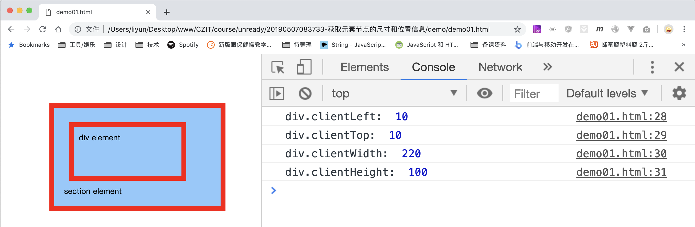

# 获取元素节点的尺寸和位置信息

拿到元素后，就可以获取元素的尺寸和位置信息了

| 属性                              | 作用                                         |
| --------------------------------- | -------------------------------------------- |
| `element.clientLeft`              | 获取元素**左边框**的宽度                     |
| `element.clientTop`               | 获取元素**上边框**的高度                     |
| `element.clientWidth`             | 获取元素的`内容+padding`的宽度               |
| `element.clientHeight`            | 获取元素的`内容+padding`的高度               |
| `element.offsetLeft`              | 获取元素**左边框边缘**到**文档最左边**的距离 |
| `element.offsetTop`               | 获取元素**上边框边缘**到**文档最顶边**的距离 |
| `element.offsetWidth`             | 获取元素的`内容+padding+border`的宽度        |
| `element.offsetHeight`            | 获取元素的`内容+padding+border`的高度        |
| `element.getClientBoundingRect()` | 获取元素的大小和相对于可视区域的位置         |

## clientLeft clientTop clientWidth clientHeight

这两个属性获取的是元素**内容**加上 `padding`的尺寸，CSS 部分我们讲过元素的盒子模型，标准盒子模型和 IE 盒子模型下元素内容尺寸是不同的：

```html
<style>
    body {
        margin: 0;
    }
    section {
        width: 300px;
        margin-left: 100px;
        margin-top: 100px;
        background-color: rgb(142, 201, 253);
        border: 10px solid red;
        padding: 20px;
    }
    div {
        width: 200px;
        height: 80px;
        border: 10px solid red;
        padding: 10px;
        margin: 10px;
    }
</style>
<section>
    <div>div element</div>
    section element
</section>

<script>
    var div = document.querySelector("div");
    console.log("div.clientLeft: ", div.clientLeft);
    console.log("div.clientTop: ", div.clientTop);
    console.log("div.clientWidth: ", div.clientWidth);
    console.log("div.clientHeight: ", div.clientHeight);
</script>
```

[案例源码](./demo/dem01.html)



如果把 div 改为 IE 盒子模型，它的样式和结果应该是这样的：

[案例源码](./demo/dem02.html)


要注意的是：`clientWidth`和`clientHeight`获取的尺寸不包含滚动条。也就是说如果元素有滚动条，获取的尺寸应该是**内容宽度+边框宽度-滚动条宽度**

```html
<style>
    body {
        margin: 0;
    }
    section {
        width: 300px;
        margin-left: 100px;
        margin-top: 100px;
        background-color: rgb(142, 201, 253);
        border: 10px solid red;
        padding: 20px;
    }
    div {
        width: 200px;
        height: 80px;
        border: 10px solid red;
        padding: 10px;
        margin: 10px;
        overflow: scroll;
    }
</style>
<section>
    <div>div element</div>
    section element
</section>

<script>
    var div = document.querySelector("div");
    console.log("div.clientLeft: ", div.clientLeft);
    console.log("div.clientTop: ", div.clientTop);
    console.log("div.clientWidth: ", div.clientWidth);
    console.log("div.clientHeight: ", div.clientHeight);
</script>
```

[案例源码](./demo/dem03.html)


从结果中可以看出，chrome 浏览器中滚动条占了 15 像素的宽度。

## offsetLeft offsetTop offsetWidth offsetHeight

```html
<style>
    body {
        margin: 0;
    }
    section {
        width: 300px;
        margin-left: 100px;
        margin-top: 100px;
        background-color: rgb(142, 201, 253);
        border: 10px solid red;
        padding: 20px;
    }
    div {
        width: 200px;
        height: 80px;
        border: 10px solid red;
        padding: 10px;
        margin: 10px;
    }
</style>
<section>
    <div>div element</div>
    section element
</section>

<script>
    var div = document.querySelector("div");
    console.log("div.offsetLeft: ", div.offsetLeft);
    console.log("div.offsetTop: ", div.offsetTop);
    console.log("div.offsetWidth: ", div.offsetWidth);
    console.log("div.offsetHeight: ", div.offsetHeight);
</script>
```

[案例源码](./demo/dem04.html)


如果 div 使用了 IE 盒子模型，它的结果应该是这样的：

[案例源码](./demo/dem05.html)


## getClientBoundingRect()

`element.getClientBoundingRect()`方法获取的是一个对象，该对象包含了元素的所有尺寸和位置信息：

| 属性名   | 属性值                                       |
| -------- | -------------------------------------------- |
| `width`  | 元素整体所占的宽度，包含 margin 高度         |
| `height` | 元素整体所占的高度，包含 margin 高度         |
| `left/x` | 元素左边框边缘到**浏览器可视区域左边**的距离 |
| `right`  | 元素右边框边缘到**浏览器可视区域顶边**的距离 |
| `top/y`  | 元素上边框边缘到**浏览器可视区域左边**的距离 |
| `bottom` | 元素下边框边缘到**浏览器可视区域顶边**的距离 |

```html
<style>
    body {
        height: 800px;
    }
    div {
        width: 200px;
        height: 80px;
        border: 10px solid red;
        padding: 10px;
    }
    div:nth-child(2) {
        box-sizing: border-box;
    }
</style>
<div>we are family1</div>
<div>we are family2</div>

<script>
    var div1 = document.querySelector("div:nth-child(1)");
    console.log("div1:", div1.getBoundingClientRect());

    var div2 = document.querySelector("div:nth-child(2)");
    console.log("div2:", div2.getBoundingClientRect());
</script>
```

[案例源码](./demo/dem06.html)


滚动页面后，元素超出了浏览器可视区域时，返回的位置信息中可能出现负数。
