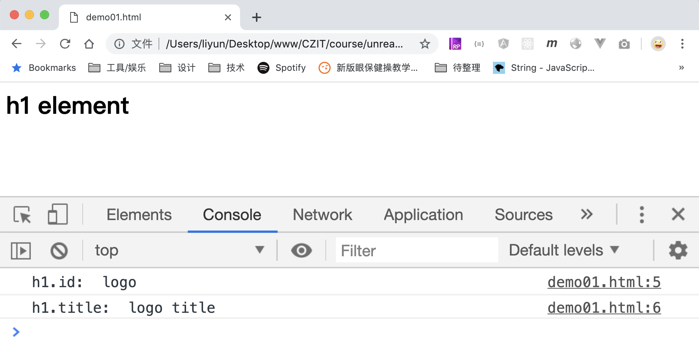
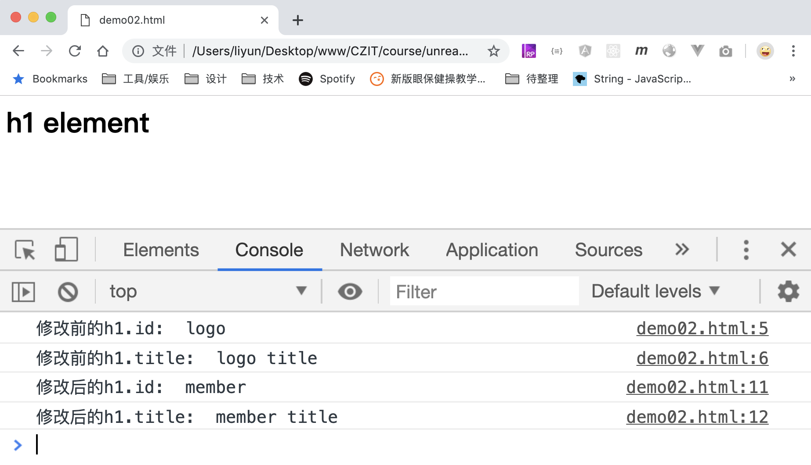
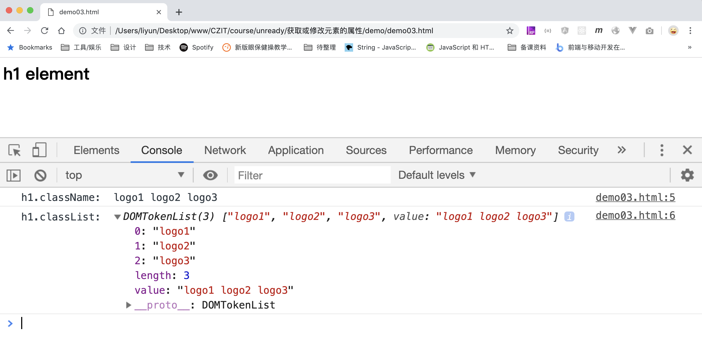

# 获取或修改元素标签上的属性

元素标签上可以定义许多属性，可以通过它们获取已有属性的值，或者新增属性，或者修改已有属性的属性值(class 属性除外)。

比如：

```html
<h1 id="logo" title="logo title">h1 element</h1>

<script>
    var h1 = document.querySelector("h1");
    console.log("h1.id: ", h1.id);
    console.log("h1.title: ", h1.title);
</script>
```

[案例源码](./demo/demo01.html)



还可以通过这些属性修改已有属性的属性值：

```html
<h1 id="logo" title="logo title">h1 element</h1>

<script>
    var h1 = document.querySelector("h1");
    console.log("修改前的h1.id: ", h1.id);
    console.log("修改前的h1.title: ", h1.title);

    h1.id = "member";
    h1.title = "member title";

    console.log("修改后的h1.id: ", h1.id);
    console.log("修改后的h1.title: ", h1.title);
</script>
```

[案例源码](./demo/demo02.html)



## class 属性的值

这些标签属性中`class`属于特殊情况，不能通过这个属性获取元素的类名，要通过`element.className`或者`element.classList`来获取：

```html
<h1 id="logo" title="logo title" class="logo1 logo2 logo3">h1 element</h1>

<script>
    var h1 = document.querySelector("h1");
    console.log("h1.className: ", h1.className);
    console.log("h1.classList: ", h1.classList);
</script>
```

[案例源码](./demo/demo03.html)


