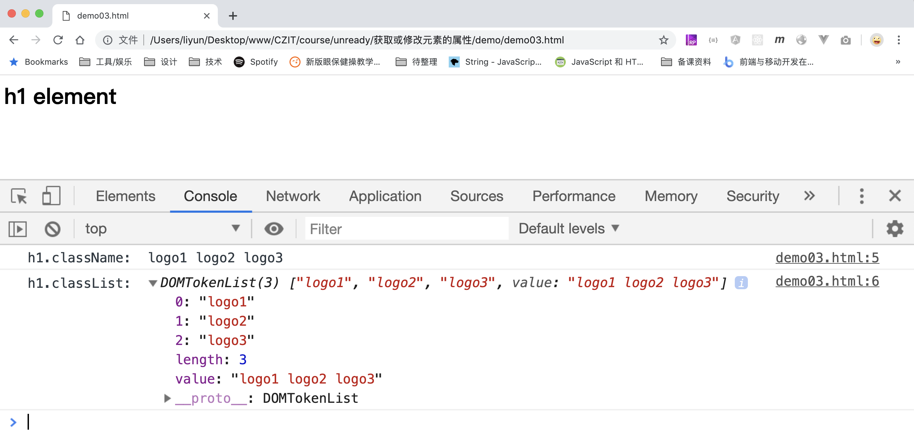
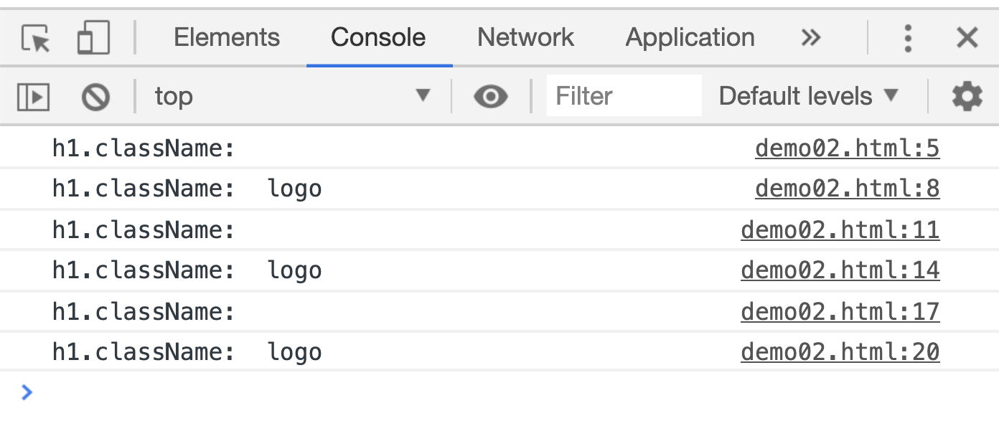

# 获取和修改元素的 class 属性

在元素的标签属性中`class`属于特殊情况，不能通过这个属性获取元素的类名，要通过`element.className`或者`element.classList`来获取：

```html
<h1 id="logo" title="logo title" class="logo1 logo2 logo3">h1 element</h1>

<script>
    var h1 = document.querySelector("h1");
    console.log("h1.className: ", h1.className);
    console.log("h1.classList: ", h1.classList);
</script>
```

[案例源码](./demo/demo01.html)



## element.classList

通过`element.classList`的返回值可以随意操作元素的`class`属性值。返回值拥有`add()/remove()/toggle()`方法：

| 方法                             | 作用                                         |
| -------------------------------- | -------------------------------------------- |
| `element.classList.add(name)`    | 给元素添加类名                               |
| `element.classList.remove(name)` | 删除已有类名                                 |
| `element.classList.toggle(name)` | 如果已有该类名，就删除该类名，否则添加该类名 |

```html
<h1>h1 element</h1>

<script>
    var h1 = document.querySelector("h1");
    console.log("h1.className: ", h1.className);

    h1.classList.add("logo");
    console.log("h1.className: ", h1.className);

    h1.classList.remove("logo");
    console.log("h1.className: ", h1.className);

    h1.classList.toggle("logo");
    console.log("h1.className: ", h1.className);

    h1.classList.toggle("logo");
    console.log("h1.className: ", h1.className);

    h1.classList.toggle("logo");
    console.log("h1.className: ", h1.className);
</script>
```

[案例源码](./demo/demo02.html)


