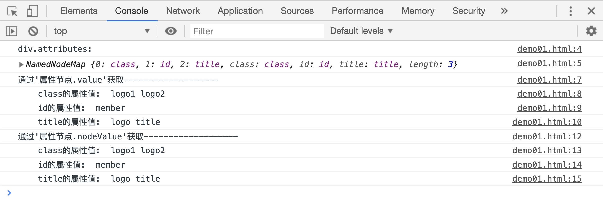
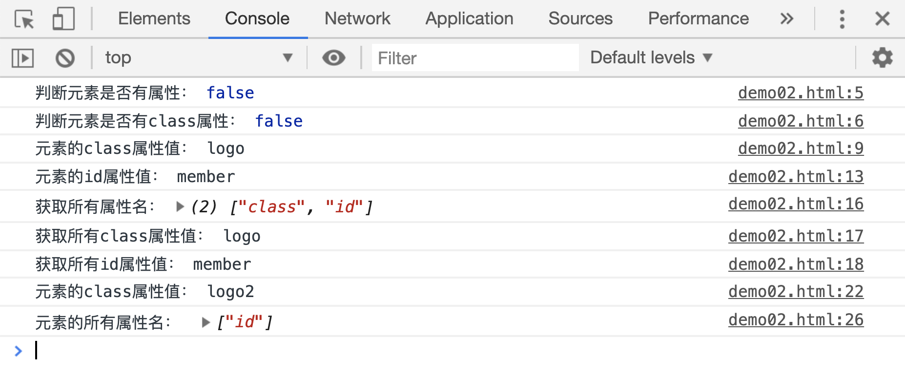

# 关于元素标签属性的一些方法

除了直接使用`元素.属性名`的方式来获取或者设置、修改标签属性，js 还提供了以下方式来操作标签属性：

| 属性/方法                          | 作用                               |
| ---------------------------------- | ---------------------------------- |
| `elment.attributes`                | 获取元素的所有属性列表             |
| `elment.hasAttributes()`           | 判断元素标签中是否有属性节点       |
| `elment.hasAttribute(name)`        | 判断元素标签中是否含有指定属性节点 |
| `elment.setAttribute(name, value)` | 在元素上新增或修改属性节点         |
| `elment.getAttributeNames()`       | 获取元素标签中的所有属性名         |
| `elment.getAttribute(name)`        | 获取元素标签中指定属性的值         |
| `elment.removeAttribute(name)`     | 移除元素中的某个属性节点           |

## attributes

`element.attributes`属性可以获取一个**属性节点**集合,这个集合中包含了该元素上的所有**属性节点**，通过属性节点的`value`或者`nodeValue`属性可以拿到对应属性的属性值。

```html
<div class="logo1 logo2" id="member" title="logo title"></div>
<script>
    var div = document.querySelector("div");
    console.log("div.attributes: ");
    console.log(div.attributes);

    console.log("通过'属性节点.value'获取-------------------");
    console.log("    class的属性值: ", div.attributes.class.value);
    console.log("    id的属性值: ", div.attributes.id.value);
    console.log("    title的属性值: ", div.attributes.title.value);

    console.log("通过'属性节点.nodeValue'获取-------------------");
    console.log("    class的属性值: ", div.attributes.class.nodeValue);
    console.log("    id的属性值: ", div.attributes.id.nodeValue);
    console.log("    title的属性值: ", div.attributes.title.nodeValue);
</script>
```

[案例源码](./demo/demo01.html)



下面来看看新增、修改、删除属性的案例：

```html
<div>div element</div>
<script>
    var div = document.querySelector("div");
    var divAttrs = div.attributes;
    console.log("判断元素是否有属性：", div.hasAttributes());
    console.log("判断元素是否有class属性：", div.hasAttribute("class"));

    // 新增class属性,设置属性值为logo
    div.setAttribute("class", "logo");
    console.log("元素的class属性值：", div.attributes.class.value);

    // 新增id属性，属性值为member
    div.setAttribute("id", "member");
    console.log("元素的id属性值：", div.attributes.id.value);

    // 获取class的所有属性名
    console.log("获取所有属性名：", div.getAttributeNames());
    console.log("获取所有class属性值：", div.getAttribute("class"));
    console.log("获取所有id属性值：", div.getAttribute("id"));

    // 修改class属性值为logo2
    div.setAttribute("class", "logo2");
    console.log("元素的class属性值：", div.getAttribute("class"));

    // 删除class属性
    div.removeAttribute("class");
    console.log("元素的所有属性名： ", div.getAttributeNames());
</script>
```

[案例源码](./demo/demo02.html)


