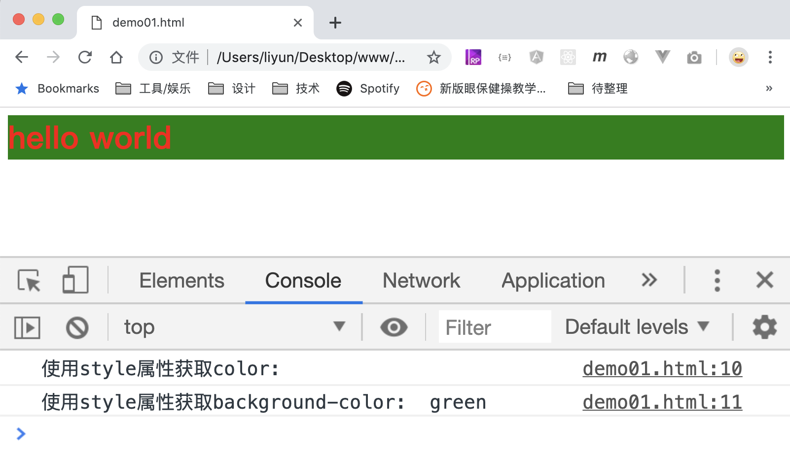
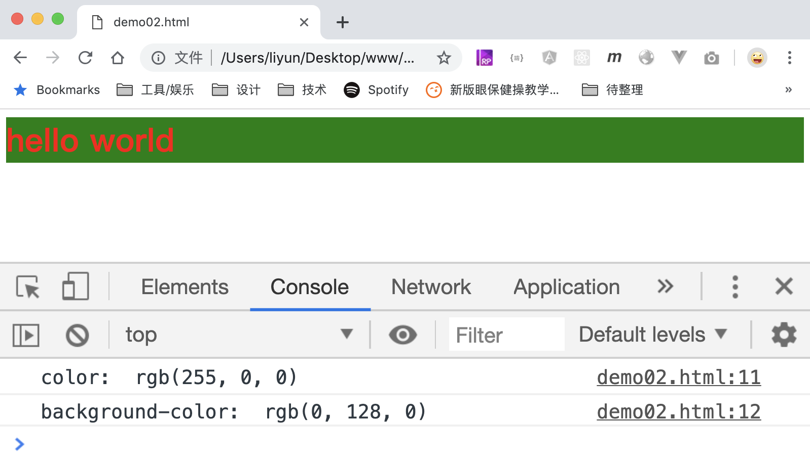
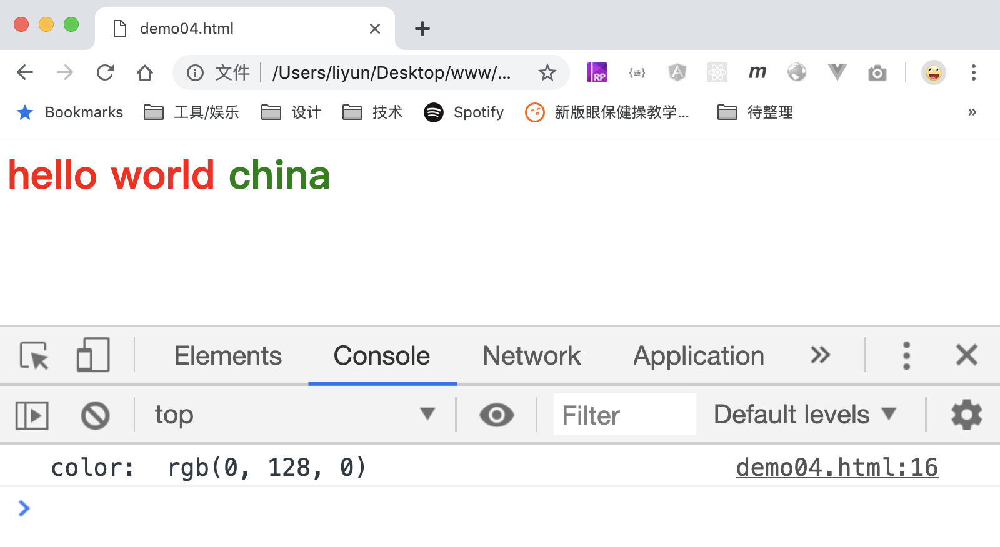

# 获取或修改元素的样式

通过元素标签上的`style`属性，只可以获取或者修改元素的**内联样式**：

```html
<style>
    h1 {
        color: red;
    }
</style>

<h1 style="background-color: green;">hello world</h1>
<script>
    var h1 = document.querySelector("h1");
    console.log("使用style属性获取color: ", h1.style.color);
    console.log(
        "使用style属性获取background-color: ",
        h1.style.backgroundColor,
    );
</script>
```

[案例源码](./demo/demo01.html)



> `color`样式没有定义在元素的`style`属性内，所以是获取不到的，返回值是一个空字符串。

## window.getComputedStyle(element [, pseudoEle])

如果想要获取元素最终的所有样式，可以使用`window.getComputedStyle(element [, pseudoEle])`方法：

```html
<style>
    h1 {
        color: red;
    }
</style>

<h1 style="background-color: green;">hello world</h1>
<script>
    var h1 = document.querySelector("h1");
    var styles = window.getComputedStyle(h1);
    console.log("color: ", styles.color);
    console.log("background-color: ", styles.backgroundColor);
</script>
```

[案例源码](./demo/demo02.html)



要注意：该方法中的`element`必须是个标准的**元素**节点，如果想要获取一个**伪元素**的样式，可以利用第二个参数`pseudoEle`:

```html
<style>
    h1 {
        color: red;
    }
    h1::after {
        content: " china";
        color: green;
    }
</style>

<h1>hello world</h1>
<script>
    var h1 = document.querySelector("h1");

    var currentStyle = window.getComputedStyle(h1, "::after");
    console.log("使用getComputedStyle获取color: ", currentStyle.color);
</script>
```

[案例源码](./demo/dem03.html)



## 设置元素样式

通过`element.style`还可以用来设置元素的样式，这些样式会添加在元素的**内联样式**中：

```html
<style>
    h1 {
        color: red;
    }
</style>

<h1>hello world</h1>
<script>
    var h1 = document.querySelector("h1");
    console.log("修改前的color: ", window.getComputedStyle(h1).color);

    h1.style.color = "green";
    console.log("修改后的color: ", window.getComputedStyle(h1).color);
</script>
```

[案例源码](./demo/dem04.html)


> 注意：使用`style`设置样式时，样式名需要适应驼峰命名法！
