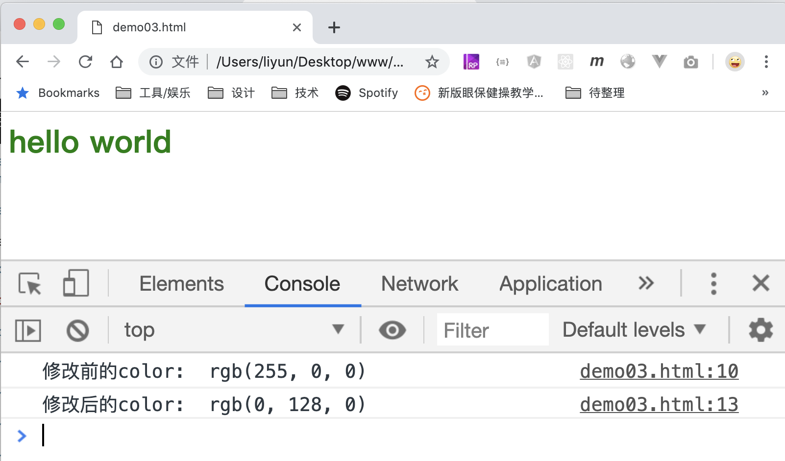

# 设置元素的 CSS 样式

通过`style`属性还可以用来设置元素的样式，这些样式会添加在元素的**内联样式**中：

```html
<style>
    h1 {
        color: red;
    }
</style>

<h1>hello world</h1>
<script>
    var h1 = document.querySelector("h1");
    console.log("修改前的color: ", window.getComputedStyle(h1).color);

    h1.style.color = "green";
    console.log("修改后的color: ", window.getComputedStyle(h1).color);
</script>
```

[案例源码](./demo/dem01.html)



> 注意：使用`style`设置样式时，样式名需要适应驼峰命名法！
