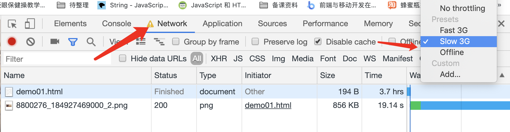

# 事件

用户操作页面时，引起浏览器触发某些特定的行为，这个过程叫做**事件**。在浏览器中，事件有很多种，比如用户通过点击元素，让该元素背景色发生变化，这是一个事件。 用户按下键盘中的某个按键，引起浏览器刷新了当前页面，这也是一个事件。

用户操作引起浏览器出发某些行为，属于外部触发的事件，浏览器和网页本身也会触发一些事件，比如当前页面加载完成时，也会触发一个加载完成的事件，我们可以通过某种方法，来相应这个事件，比如前面用过的`window.onload`，这个就表示**当前页面加载完成**的事件，通过这个属性，我们可以自定义页面加载完成后，想让 JS 做的事件。

```html

<script>
    window.onload = function() {
        console.log("页面内的资源已经全部加载完成");
    };
</script>
```

[案例源码](./demo/demo01.html)

在打开这个案例前，需要模拟一下网速很慢时的情况，可以在开发者工具的`network`面板上把网络模式切换为`Slow 3G`：



再次刷新页面，可以看到在图片加载完成之后，控制台中才开始打印出“页面内的资源已经全部加载完成”的文字。

## 事件的类型

事件的类型有很多，比如：

1. 资源事件：类似于`window.onload`，定义某个资源加载成功或者失败时发生的事件
2. 网络事件：定义当前设备网络连接成功或者连接失败时发生的事件
3. 焦点事件：定义元素获取焦点或者失去焦点时发生的事件
4. 视图事件：定义浏览器开始、结束全屏，改变浏览器大小，页面或元素滚动时发生的事件
5. 鼠标事件：定义用户点击鼠标时发生的事件
6. 键盘事件：定义用户触发键盘时发生的事件
7. 表单事件：定义表单元素重置或提交时的事件
8. CSS 动画事件：定义 CSS 动画开始、结束、重新触发时的事件
9. CSS 过渡事件：定义 CSS 过渡开始、暂停或结束、取消时的事件

除了上面这些还有一些其他类型的事件，具体可以参考[MDN 事件](https://developer.mozilla.org/zh-CN/docs/Web/Events)

## 资源事件

| 事件名         | 作用                         |
| -------------- | ---------------------------- |
| `load`         | 相关资源已经被加载完成事件   |
| `unload`       | 相关资源被卸载事件           |
| `beforeunload` | 相关资源被卸载之前发生的事件 |
| `error`        | 相关资源加载失败事件         |

## 网络事件

| 事件名    | 作用           |
| --------- | -------------- |
| `online`  | 网络已连接事件 |
| `offline` | 网络已断开事件 |

## 窗口事件

| 事件名   | 作用                     |
| -------- | ------------------------ |
| `resize` | 可视区域范围发生改变事件 |
| `scroll` | 滚动条发生变化事件       |

## 鼠标事件

操作浏览器的过程中，大部分时间都在使用鼠标。所以鼠标事件是使用频率最频繁的事件。主要包含以下事件：

| 事件名       | 作用                       |
| ------------ | -------------------------- |
| `click`      | 鼠标单击事件               |
| `dblclick`   | 鼠标双击事件               |
| `mousedown`  | 鼠标在元素上按下按键的事件 |
| `mouseup`    | 鼠标在元素上松开按键的事件 |
| `mouseenter` | 鼠标进入元素事件           |
| `mouseleave` | 鼠标离开元素事件           |
| `mousemove`  | 鼠标在元素上移动事件       |
| `mouseover`  | 鼠标移动到元素上事件       |
| `mouseout`   | 鼠标从元素上移除事件       |
| `wheel`      | 鼠标滚轮向任意方向滚动事件 |
| `select`     | 文本被选中事件             |
| `contextmenu`   | 右键打开菜单事件           |

## 键盘事件

| 事件名     | 作用           |
| ---------- | -------------- |
| `keypress` | 键盘被按住事件 |
| `keydown`  | 键盘被按下事件 |
| `keyup`    | 键盘被松开事件 |

## 表单事件

| 事件名   | 作用           |
| -------- | -------------- |
| `reset`  | 表单被重置事件 |
| `submit` | 表单被提交事件 |

## 表单控件事件

| 事件名   | 作用                                                              |
| -------- | ----------------------------------------------------------------- |
| `focus`  | 输入框获取焦点事件                                                |
| `blur`   | 输入框失去焦点事件                                                |
| `change` | 鼠标离开输入框时，如果输入框的值发生了变化，触发该事件            |
| `input`  | 在`<input>`、`<select>`或 `<textarea>` 元素中输入文字时触发该事件 |
