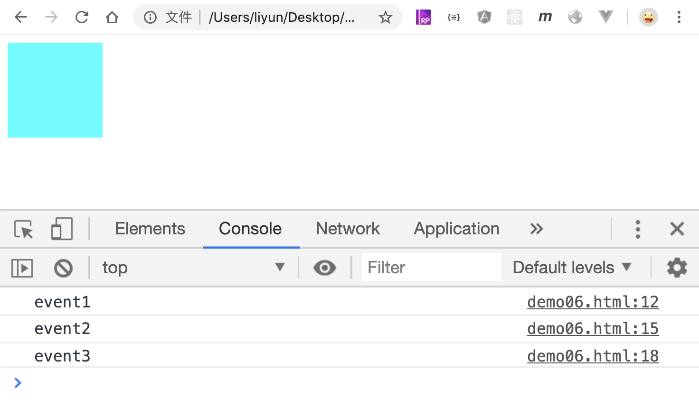

# 一个事件添加多个侦听函数

前面讲的添加事件方式，都只能给元素的同一个监听事件添加一个侦听函数，就可能导致先添加的侦听函数被后添加的侦听函数覆盖，比如：

```html
<div onclick="add()">element</div>
<script>
    var div = document.querySelector("div");
    div.onclick = function add() {
        console.log("1");
    };
    div.onclick = function add() {
        console.log("2");
    };
    // 只有 3 被打印出来
    div.onclick = function add() {
        console.log("3");
    };
</script>
```

## `element.addEventListener(type, fn [,usecapture])

`element.addEventListener(type, fn [,usecapture])方法可以给监听对象添加多个侦听函数

| 参数         | 作用                   |
| ------------ | ---------------------- |
| `type`       | 监听事件名称           |
| `fn`         | 监听事件触发的函数     |
| `usecapture` | 设置侦听函数的执行方式 |

给同一个监听事件添加多个侦听函数可以这么写：

```html
<style>
    div {
        width: 100px;
        height: 100px;
        background-color: aqua;
    }
</style>
<div></div>
<script>
    var div = document.querySelector("div");
    div.addEventListener("click", function() {
        console.log("event1");
    });
    div.addEventListener("click", function() {
        console.log("event2");
    });
    div.addEventListener("click", function() {
        console.log("event3");
    });
</script>
```

[案例源码](./demo/demo01.html)



从控制台中可以看出，给 div 元素添加的点击事件，会按照添加的顺序依次执行，后添加的不会覆盖先添加的侦听函数。
