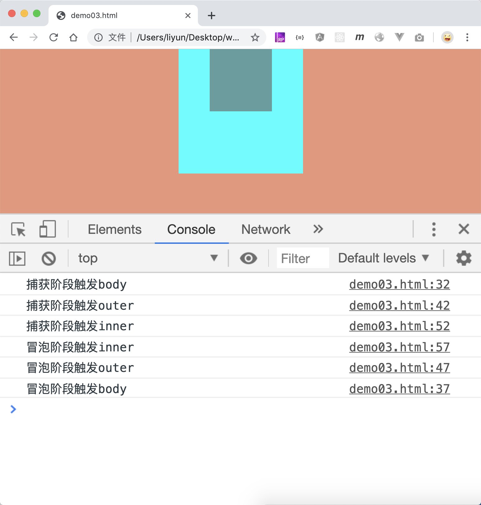
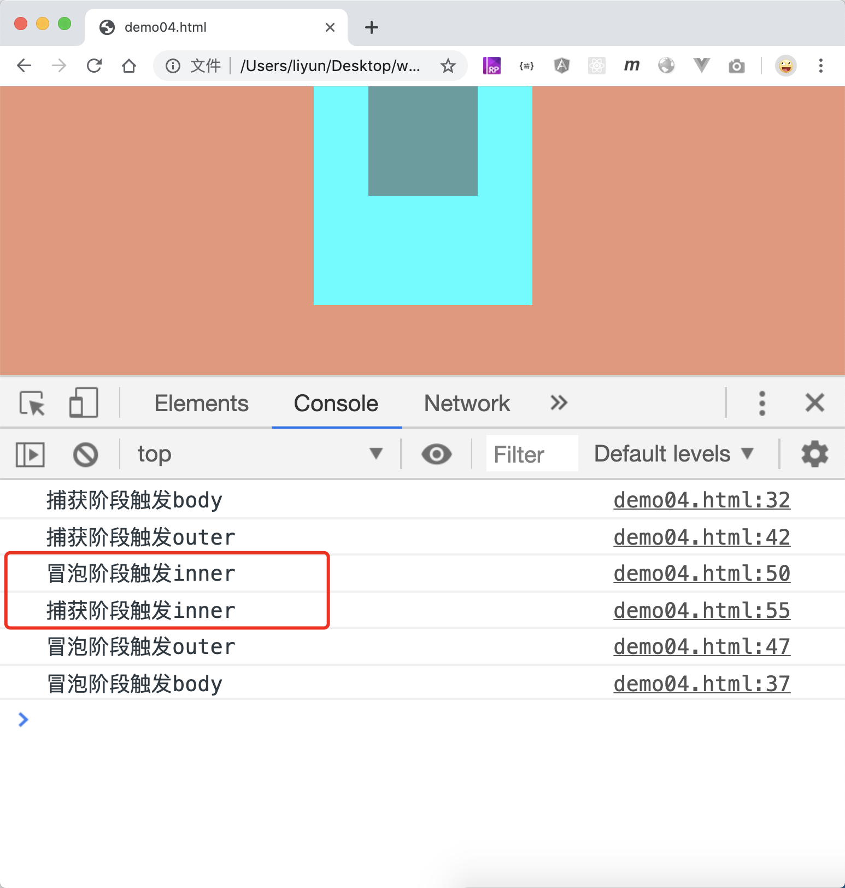

# 事件流

先来观察一个案例：

```html
<style>
    body {
        margin: 0;
        background-color: darksalmon;
    }
    div {
        margin: 0 auto;
    }
    .outer {
        width: 200px;
        height: 200px;
        background-color: aqua;
    }
    .inner {
        width: 100px;
        height: 100px;
        background-color: cadetblue;
    }
</style>

<div class="outer">
    <div class="inner"></div>
</div>

<script>
    var outerEle = document.querySelector(".outer");
    var innerEle = document.querySelector(".inner");

    document.body.addEventListener("click", function() {
        console.log("点击了body");
    });
    outerEle.addEventListener("click", function() {
        console.log("点击了.outer元素");
    });
    innerEle.addEventListener("click", function() {
        console.log("点击了.inner元素");
    });
</script>
```

[案例源码](./demo/demo01.html)

在这个案例中，我给`body .outer .inner`都添加了点击事件，`.inner`是`.outer`的后代元素，`.outer`又是`body`的后代元素，点击了`.inner`就相当于点击了`.outer`和`body`。如果我在`.inner`上点击一次，它们三个的事件谁的侦听函数优先执行呢？

最初的时候，Netscape 公司决定这种事件依次从外向内执行，即先执行`body`上的侦听函数，再执行`.outer`上的侦听函数，最后执行`.inner`上的侦听函数。

而 IE 公司就调皮了，为了体现出自己的地位，偏要不走寻常路。就是要反过来从内往外执行，即先执行`.inner`的侦听函数，再执行`.outer`的侦听函数，最后执行`body`的侦听函数。

这两种截然不同的执行方式，都叫做**事件流**。

从外而内的执行方式，被称为**事件捕获**，从内而外的执行方式，被称为**事件冒泡**， 。两个公司的政策不同，被坑的只有开发人员。后来为了 W3C 组织为了统一规范，决定把两者合二为一：

> 如果父子元素都添加了相同的监听事件，先执行事件捕获，再执行事件冒泡。也就是说： 先从外向内执行侦听函数，再从内向外执行函数。

这样一来，元素的事件流就分为了三个阶段：`事件捕获阶段、处于目标阶段和事件冒泡阶段`。

并且新增了`element.addEventListener(eventType, fn [, useCapture])`函数，可以由该函数的第三个参数，决定添加的侦听函数具体在哪个阶段执行。`useCapture`的默认值是`false`,表示改侦听函数会在事件冒泡阶段执行。

所以上面代码的执行结果应该是这样的：


如果把`useCapture`设置为 true，就表示此处添加的侦听函数会在事件捕获阶段执行：

```html
<style>
    body {
        margin: 0;
        background-color: darksalmon;
    }
    div {
        margin: 0 auto;
    }
    .outer {
        width: 200px;
        height: 200px;
        background-color: aqua;
    }
    .inner {
        width: 100px;
        height: 100px;
        background-color: cadetblue;
    }
</style>

<div class="outer">
    <div class="inner"></div>
</div>

<script>
    var outerEle = document.querySelector(".outer");
    var innerEle = document.querySelector(".inner");

    document.body.addEventListener(
        "click",
        function() {
            console.log("点击了body");
        },
        true,
    );
    outerEle.addEventListener(
        "click",
        function() {
            console.log("点击了.outer元素");
        },
        true,
    );
    innerEle.addEventListener(
        "click",
        function() {
            console.log("点击了.inner元素");
        },
        true,
    );
</script>
```

[案例源码](./demo/demo02.html)


这里三个侦听函数都被设置为在事件捕获阶段执行，所以`body`的侦听函数优先执行，接着执行`.outer`的侦听函数，最后执行`.inner`的侦听函数。

现在为了验证统一后的事件流，我们给`body .outer .inner`分别添加 1 个事件捕获阶段的侦听函数，和 1 个事件冒泡阶段的侦听函数：

```html
<style>
    body {
        margin: 0;
        background-color: darksalmon;
    }
    div {
        margin: 0 auto;
    }
    .outer {
        width: 200px;
        height: 200px;
        background-color: aqua;
    }
    .inner {
        width: 100px;
        height: 100px;
        background-color: cadetblue;
    }
</style>

<div class="outer">
    <div class="inner"></div>
</div>

<script>
    var outerEle = document.querySelector(".outer");
    var innerEle = document.querySelector(".inner");

    document.body.addEventListener(
        "click",
        function() {
            console.log("捕获阶段触发body");
        },
        true,
    );
    document.body.addEventListener("click", function() {
        console.log("冒泡阶段触发body");
    });
    outerEle.addEventListener(
        "click",
        function() {
            console.log("捕获阶段触发outer");
        },
        true,
    );
    outerEle.addEventListener("click", function() {
        console.log("冒泡阶段触发outer");
    });
    innerEle.addEventListener(
        "click",
        function() {
            console.log("捕获阶段触发inner");
        },
        true,
    );
    innerEle.addEventListener("click", function() {
        console.log("冒泡阶段触发inner");
    });
</script>
```

[案例源码](./demo/demo03.html)



从控制台中可以看出，添加的这些侦听函数，确实是先执行了定义在捕获阶段执行的函数，再执行定义在冒泡阶段的函数。

## 注意

现在我们把前面的代码顺序调整一下：

```html
<style>
    body {
        margin: 0;
        background-color: darksalmon;
    }
    div {
        margin: 0 auto;
    }
    .outer {
        width: 200px;
        height: 200px;
        background-color: aqua;
    }
    .inner {
        width: 100px;
        height: 100px;
        background-color: cadetblue;
    }
</style>

<div class="outer">
    <div class="inner"></div>
</div>

<script>
    var outerEle = document.querySelector(".outer");
    var innerEle = document.querySelector(".inner");

    document.body.addEventListener(
        "click",
        function() {
            console.log("捕获阶段触发body");
        },
        true,
    );
    document.body.addEventListener("click", function() {
        console.log("冒泡阶段触发body");
    });
    outerEle.addEventListener(
        "click",
        function() {
            console.log("捕获阶段触发outer");
        },
        true,
    );
    outerEle.addEventListener("click", function() {
        console.log("冒泡阶段触发outer");
    });
    innerEle.addEventListener("click", function() {
        console.log("冒泡阶段触发inner");
    });
    innerEle.addEventListener(
        "click",
        function() {
            console.log("捕获阶段触发inner");
        },
        true,
    );
</script>
```

[案例源码](./demo/demo04.html)



这个案例和上一个案例唯一不同之处在于，关于`inner`元素桑的两种侦听函数的添加顺序不同。导致最终结果不同，这是因为：

1. 事件流包含三个阶段：捕获阶段-处于目标阶段-冒泡阶段
2. 祖先元素的侦听函数，会根据`useCapture`参数的值，在捕获阶段或者冒泡阶段执行
3. 触发事件的目标元素上的侦听函数，则不受`useCapture`参数的影响，会按照侦听函数添加的先后顺序执行。

## addEventListener 的第二种用法

`element.addEventListener()`函数还有第二种用法：`element.addEventListener(type, fn [, options])`,`option`可以传入一个对象，在这个对象中也可以设置侦听函数的执行方式。

| option 属性 | 作用                                                          |
| ----------- | ------------------------------------------------------------- |
| `capture`   | 设置为`true`，表示侦听函数会在事件捕获阶段执行，默认是`false` |
| `once`      | 设置为`true`，表示侦听函数只执行一次，默认是 `false`          |

```html
<style>
    body {
        margin: 0;
        background-color: darksalmon;
    }
    div {
        margin: 0 auto;
    }
    .outer {
        width: 200px;
        height: 200px;
        background-color: aqua;
    }
    .inner {
        width: 100px;
        height: 100px;
        background-color: cadetblue;
    }
</style>

<div class="outer">
    <div class="inner"></div>
</div>

<script>
    var outerEle = document.querySelector(".outer");
    var innerEle = document.querySelector(".inner");

    document.body.addEventListener(
        "click",
        function() {
            console.log("点击了body");
        },
        {
            capture: true,
        },
    );
    outerEle.addEventListener(
        "click",
        function() {
            console.log("点击了.outer元素");
        },
        {
            capture: true,
        },
    );
    innerEle.addEventListener(
        "click",
        function() {
            console.log("点击了.inner元素");
        },
        {
            capture: true,
        },
    );
</script>
```

[案例源码](./demo/demo05.html)


> 为了兼容早期版本的 IE 浏览器，一般很少会把侦听事件放在捕获阶段执行
