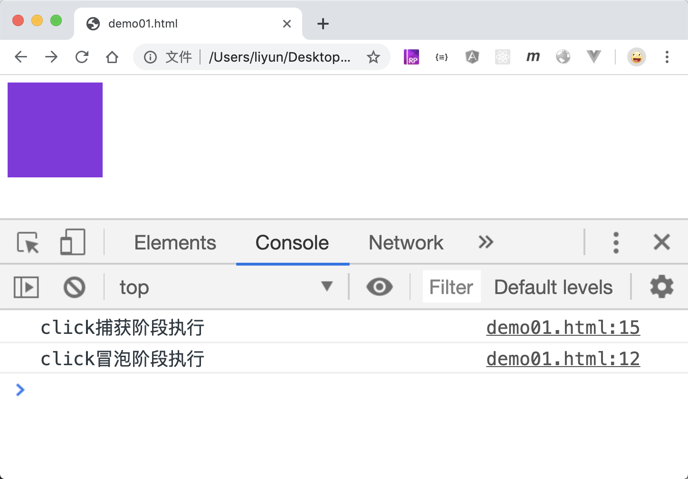
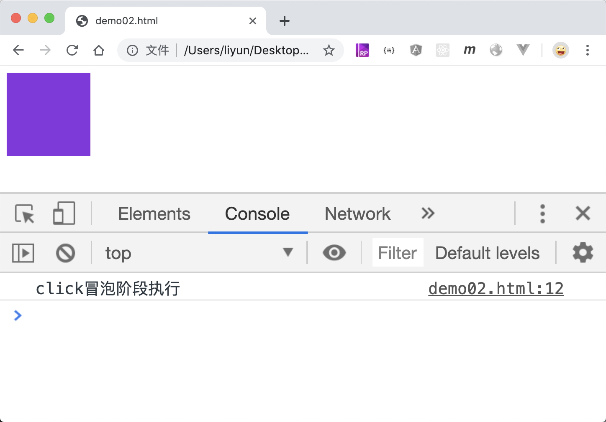

# 移除侦听函数

`element.removeEventListener()`函数专门用来移除元素上的监听事件，同样有两种用法：

1. `element.removeEventListener(type, listener [,useCapture])`
2. `element.removeEventListener(type, listener [,option])`

需要注意的是：如果已经确定侦听函数会在未来的某个时间点移除，该函数必须是一个具名函数，也就是说，在增加侦听函数时，侦听哈数必须是一个具名函数，不能使用匿名函数。

先来看一个案例：

```html
<style>
    .outer {
        width: 100px;
        height: 100px;
        background-color: blueviolet;
    }
</style>
<div class="outer"></div>
<script>
    var outer = document.querySelector(".outer");
    function clickMaoPao() {
        console.log("click冒泡阶段执行");
    }
    function clickBuHuo() {
        console.log("click捕获阶段执行");
    }
    outer.addEventListener("click", clickBuHuo, {
        capture: true,
    });
    outer.addEventListener("click", clickMaoPao);

    outer.removeEventListener("click", clickBuHuo);
</script>
```

[案例源码](./demo/demo01.html)



这个案例中，明明已经移除了捕获阶段的函数`clickBuhuo`，但是点击的时候发现，这个函数依然被执行了。这是因为默认情况下，JS 引擎会移除**冒泡阶段**中执行的某个侦听该函数，如果先移除捕获阶段的某个侦听函数，就必须使用该函数的第三个参数。

```html
<style>
    .outer {
        width: 100px;
        height: 100px;
        background-color: blueviolet;
    }
</style>
<div class="outer"></div>
<script>
    var outer = document.querySelector(".outer");
    function clickMaoPao() {
        console.log("click冒泡阶段执行");
    }
    function clickBuHuo() {
        console.log("click捕获阶段执行");
    }
    outer.addEventListener("click", clickBuHuo, {
        capture: true,
    });
    outer.addEventListener("click", clickMaoPao);

    outer.removeEventListener("click", clickBuHuo, true);
</script>
```

[案例源码](./demo/demo02.html)



现在，捕获阶段的那个侦听函数已经被移除了
