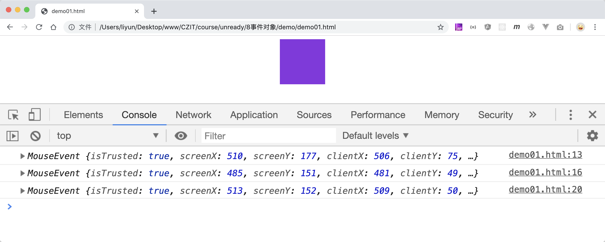

# 事件对象

当事件发生时，有一个 event 对象，或被创建并被传递给侦听函数，，通过这个对象可以获取到事件发生时的详细信息。这个事件对象有以下几种获取方式：

```html
<style>
    div {
        width: 100px;
        height: 100px;
        background-color: blueviolet;
        margin: 0 auto;
    }
</style>
<div onmouseenter="mouseenterFn(event)"></div>
<script>
    var div = document.querySelector("div");
    function mouseenterFn(event) {
        console.log(event);
    }
    div.onclick = function(event) {
        console.log(event);
    };

    div.addEventListener("mouseleave", function(event) {
        console.log(event);
    });
</script>
```

[案例源码](./demo/demo01.html)



## 事件对象中的属性

这些信息和具体的事件类型有关，所有的事件对象都包含以下基础属性：

| 属性/方法                          | 作用                                               |
| ---------------------------------- | -------------------------------------------------- |
| `event.type`                       | 事件类型                                           |
| `event.currentTarget`              | 指向侦听函数的监听对象                             |
| `event.target`                     | 指向真实触发事件的元素                             |
| `event.bubbles`                    | 表示该事件是否会向上冒泡                           |
| `event.isTrusted`                  | `true`表示事件由用户触发,`false`表示事件非用户触发 |
| `event.preventDefault()`           | 阻止默认事件                                       |
| `event.stopPropagation()`          | 阻止事件冒泡                                       |
| `event.stopImmediatePropagation()` | 阻止执行后添加的侦听函数                           |

## 事件类型

事件对象的`type`属性返回事件类型，`timeStamp`属性返回事件的发生时间，是一个带小数的时间戳。

```html
<style>
    div {
        width: 100px;
        height: 100px;
        background-color: blueviolet;
        margin: 0 auto;
    }
</style>
<div></div>
<script>
    var div = document.querySelector("div");
    div.addEventListener("click", function(event) {
        console.log("事件类型： ", event.type);
    });
    div.addEventListener("mouseenter", function(event) {
        console.log("事件类型： ", event.type);
    });
    div.addEventListener("mouseleave", function(event) {
        console.log("事件类型： ", event.type);
    });
    div.addEventListener("wheel", function(event) {
        console.log("事件类型： ", event.type);
    });
    div.addEventListener("contextmenu", function(event) {
        console.log("事件类型： ", event.type);
    });
</script>
```

[案例源码](./demo/demo02.html)


