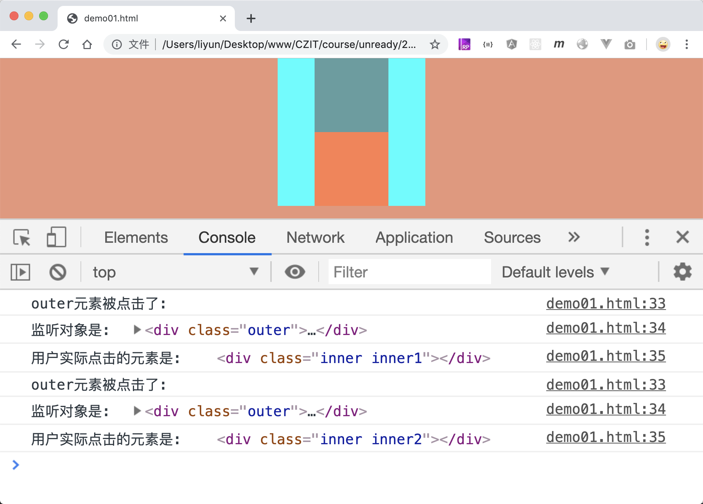

# 获取触发事件的对象和监听对象

在实际的工作中，如果给一个元素添加了点击事件，当在页面中点击了该元素的某个**后代元素**时，也会触发该元素的点击事件，这个时候，我们可能需要知道用户到底点击的是监听对象本身还是监听对象元素的某个后代元素，

这时可以利用事件对象中的`target`和`currentTarget`属性来区分：

`target`表示的是用户真实触发的元素，`currentTarget`则表示的是侦听函数所监听的元素：

```html
<style>
    body {
        margin: 0;
        background-color: darksalmon;
    }
    div {
        margin: 0 auto;
    }
    .outer {
        width: 200px;
        height: 200px;
        background-color: aqua;
    }
    .inner {
        width: 100px;
        height: 100px;
        background-color: cadetblue;
    }
    .inner2 {
        background-color: coral;
    }
</style>

<div class="outer">
    <div class="inner inner1"></div>
    <div class="inner inner2"></div>
</div>

<script>
    var outerEle = document.querySelector(".outer");

    outerEle.addEventListener("click", function(e) {
        console.log("outer元素被点击了:");
        console.log("监听对象是: ", e.currentTarget);
        console.log("用户实际点击的元素是: ", e.target);
    });
</script>
```

[案例源码](./demo/demo01.html)


