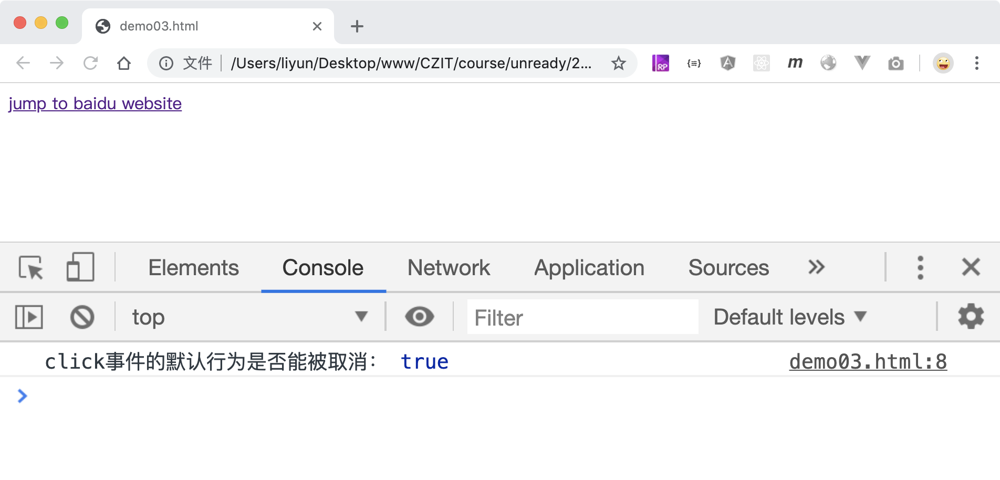

# 事件的默认行为

在浏览器的各种事件中，有一部分事件是自带默认行为的。比如超链接元素被点击后，会跳转到对应的网页，这就是它的默认行为。这种行为是可以被取消的，通过事件对象的`preventDefault()`函数。

```html
<a href="http://baidu.com">jump to baidu website</a>

<script>
    var a = document.querySelector("a");
    a.addEventListener("click", function(event) {
        // a元素被点击后，不会再有跳转行为了
        event.preventDefault();
        console.log("a元素被点击了");
    });
</script>
```

表单中的提交按钮也自带跳转页面的默认行为，同样可以使用`event.preventDefault()`取消。

```html
<form action="./demo01.html" , method="GET">
    <input type="text" name="age" value="20" />
    <button>提交表单</button>
</form>
<script>
    var btn = document.querySelector("button");
    btn.addEventListener("click", function(event) {
        // button元素被点击后，不会再有跳转行为了
        event.preventDefault();
        console.log("提交按钮被点击了");
    });
</script>
```

## 事件对象的`calelable`属性

当事件发生时，传递给侦听函数的事件对象中有一个`cancelable`属性，用来判断该事件的默认行为是否能被取消，`true`表示可以被取消，`false`表示不能被取消

```html
<a href="http://baidu.com">jump to baidu website</a>

<script>
    var a = document.querySelector("a");
    a.addEventListener("click", function(event) {
        // a元素被点击后，不会再有跳转行为了
        event.preventDefault();
        console.log("click事件的默认行为是否能被取消：", event.cancelable);
    });
</script>
```

[案例源码](./demo/demo03.html)


