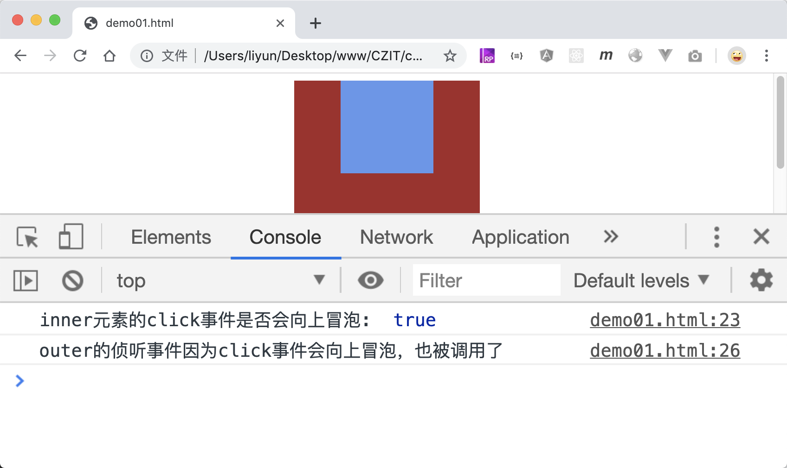

# 判断事件是否会向上冒泡

大多数事件都会默认向上冒泡，比如`click,dblclick`等。可以通过事件对象的`bubbles`属性来获取该事件是否会冒泡。`true`表示该事件会向上冒泡，`false`表示不会向上冒泡。

```html
<style>
    .outer {
        width: 200px;
        height: 200px;
        margin: 0 auto;
        background-color: brown;
    }
    .inner {
        width: 100px;
        height: 100px;
        margin: 0 auto;
        background-color: cornflowerblue;
    }
</style>
<div class="outer">
    <div class="inner"></div>
</div>
<script>
    var outer = document.querySelector(".outer");
    var inner = document.querySelector(".inner");

    inner.onclick = function(event) {
        console.log("inner元素的click事件是否会向上冒泡: ", event.bubbles);
    };
    outer.onclick = function(event) {
        console.log("outer的侦听事件因为click事件会向上冒泡，也被调用了 ");
    };
</script>
```

[案例源码](./demo/demo01.html)



那么哪些事件不会向上冒泡呢，最常见的就是`mouseenter、mouseleave`了
