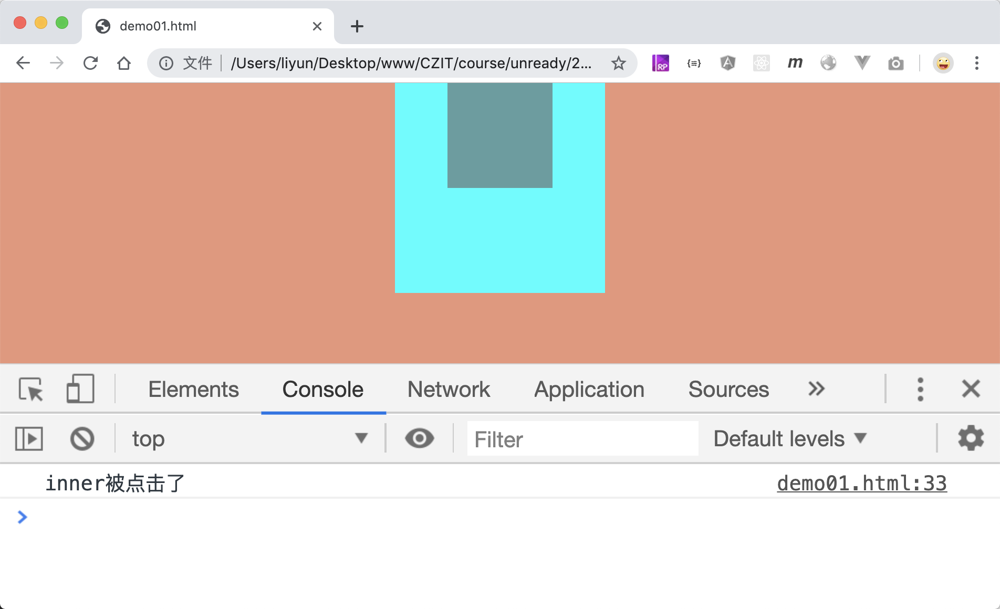

# 阻止事件冒泡

前面事件流中讲过，事件流分为三个阶段：`捕获阶段-目标元素-冒泡阶段`，当父子元素定义了相同的监听事件时，触发子元素的监听事件，父元素的监听事件也会被触发。可以通过前面讲过的事件对象阻止事件冒泡。

`event.stopPropagation()`方法可以阻止事件冒泡：

```html
<style>
    body {
        margin: 0;
        background-color: darksalmon;
    }
    div {
        margin: 0 auto;
    }
    .outer {
        width: 200px;
        height: 200px;
        background-color: aqua;
    }
    .inner {
        width: 100px;
        height: 100px;
        background-color: cadetblue;
    }
</style>

<div class="outer">
    <div class="inner inner1"></div>
</div>

<script>
    var outer = document.querySelector(".outer");
    var inner = document.querySelector(".inner");
    outer.addEventListener("click", function() {
        console.log("outer被点击了");
    });
    inner.addEventListener("click", function(event) {
        event.stopPropagation();
        console.log("inner被点击了");
    });
</script>
```

[案例源码](./demo/demo01.html)



这个案例中，点击`inner`元素后，点击事件没有冒泡，所以`outer`元素点击事件的侦听函数不会被执行，只有点击`outer`元素本身时，才会执行。
