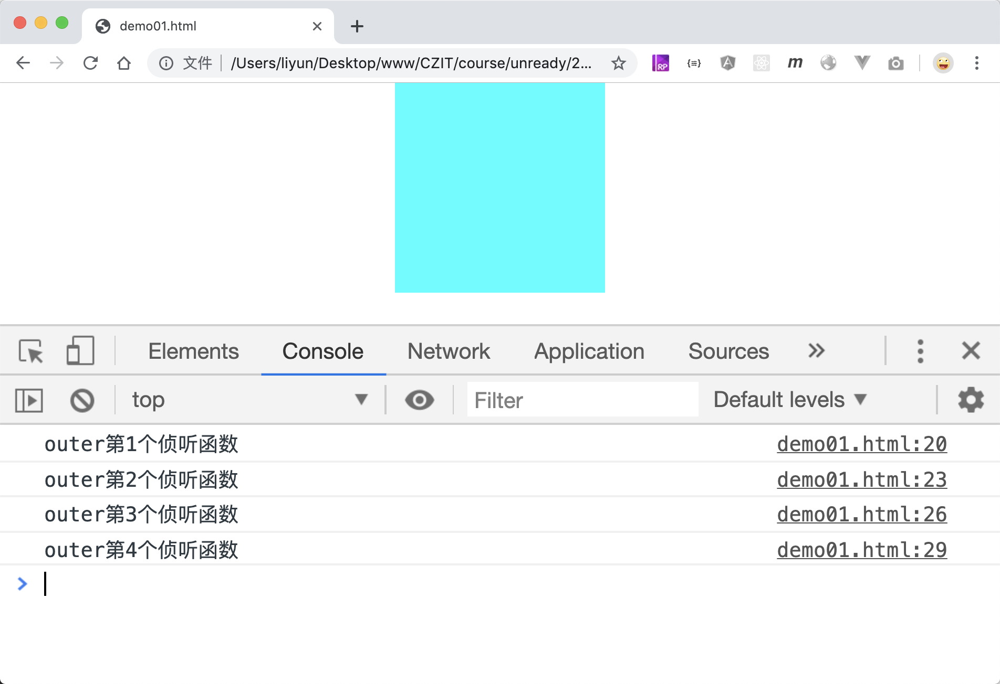
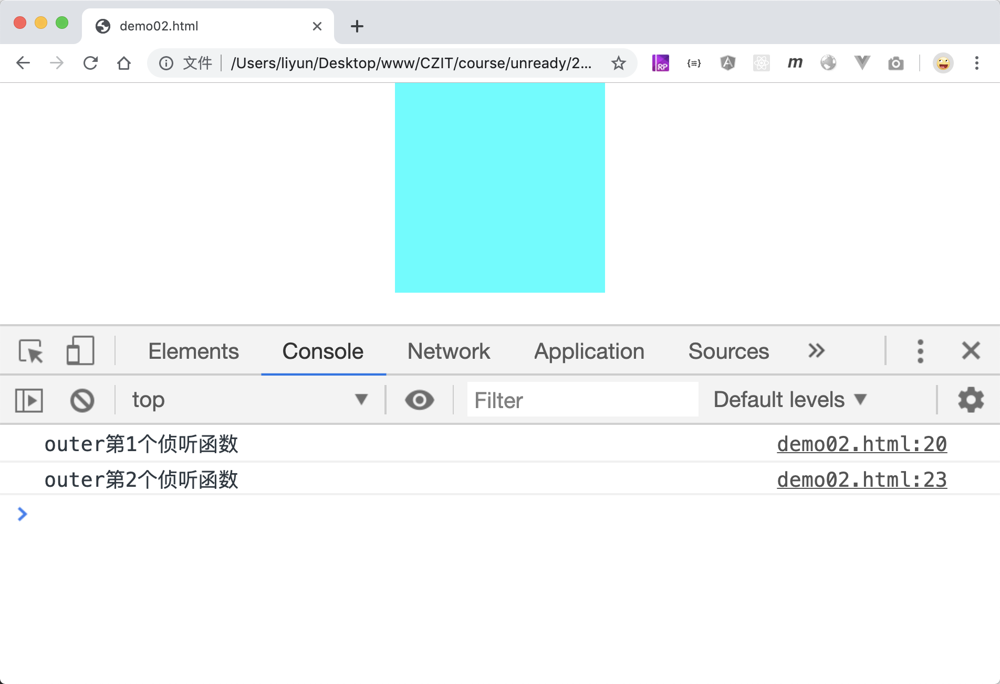

# 阻止后添加的侦听函数执行

前面说过，同一个元素的同一个监听事件，可以添加多个侦听函数，且会按照添加的先后顺序执行：

```html
<style>
    body {
        margin: 0;
    }
    div {
        margin: 0 auto;
    }
    .outer {
        width: 200px;
        height: 200px;
        background-color: aqua;
    }
</style>

<div class="outer"></div>

<script>
    var outer = document.querySelector(".outer");
    outer.addEventListener("click", function() {
        console.log("outer第1个侦听函数");
    });
    outer.addEventListener("click", function() {
        console.log("outer第2个侦听函数");
    });
    outer.addEventListener("click", function() {
        console.log("outer第3个侦听函数");
    });
    outer.addEventListener("click", function() {
        console.log("outer第4个侦听函数");
    });
</script>
```

[案例源码](./demo/demo01.html)



可以通过`event.stopImmediatePropagation()`方法，阻止后添加的侦听函数执行。

```html
<style>
    body {
        margin: 0;
    }
    div {
        margin: 0 auto;
    }
    .outer {
        width: 200px;
        height: 200px;
        background-color: aqua;
    }
</style>

<div class="outer"></div>

<script>
    var outer = document.querySelector(".outer");
    outer.addEventListener("click", function() {
        console.log("outer第1个侦听函数");
    });
    outer.addEventListener("click", function(event) {
        console.log("outer第2个侦听函数");
        // 阻止执行后添加的侦听函数
        event.stopImmediatePropagation();
    });
    outer.addEventListener("click", function() {
        console.log("outer第3个侦听函数");
    });
    outer.addEventListener("click", function() {
        console.log("outer第4个侦听函数");
    });
</script>
```

[案例源码](./demo/demo02.html)


