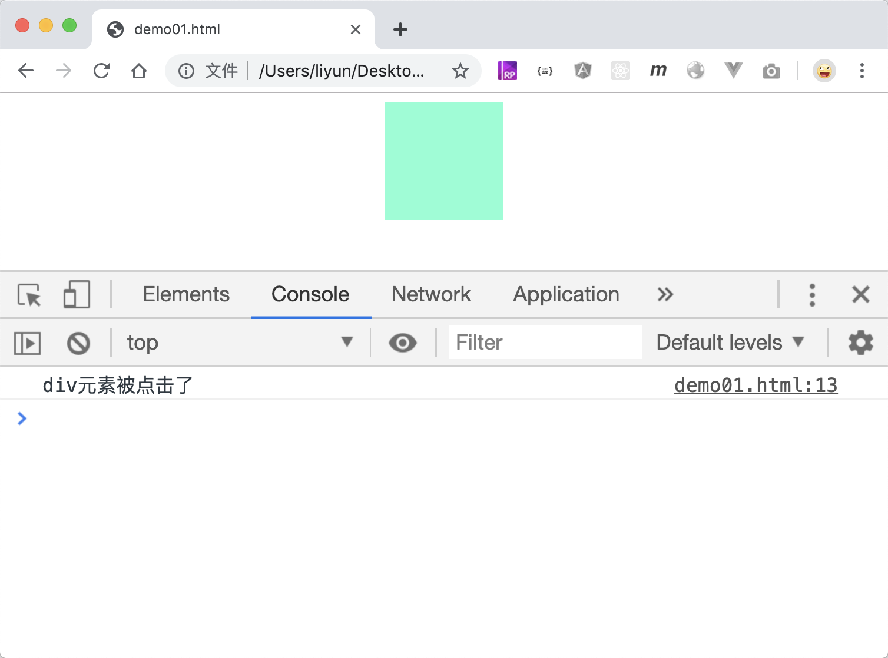

# 快速模拟触发事件

有一些事件在模拟触发的时候，不需要这么麻烦，比如点击事件，通过`element.click()`可以直接触发元素的点击事件

```html
<style>
    div {
        width: 100px;
        height: 100px;
        margin: 0 auto;
        background-color: aquamarine;
    }
</style>
<div></div>
<script>
    var div = document.querySelector("div");
    div.addEventListener("click", function() {
        console.log("div元素被点击了");
    });

    setTimeout(function() {
        div.click();
    }, 2000);
</script>
```

[案例源码](./demo/demo01.html)



除了点击事件，还有这些事件都可以快速触发：

| 方法               | 作用                             |
| ------------------ | -------------------------------- |
| `element.click()`  | 主动触发点击事件                 |
| `element.focus()`  | 主动触发文本输入框的获取焦点事件 |
| `element.submit()` | 主动触发表单提交事件             |
| `element.reset()`  | 主动触发表单重置事件             |
