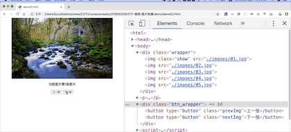

# 案例-图片轮播

要求：

1. 默认显示第一张图片
2. 点击“上一张”，显示前一张图片
3. 点击“下一张”，显示后一张图片

流程：

```
获取下一页按钮
给下一页按钮添加点击事件
    让当前元素隐藏
    让当前元素的下一个元素显示

```

[案例源码](./demo/demo01.html)


## 优化

1. 两个事件中都使用了 img 元素的集合，且在事件中，img 元素的数量没有变化，可以把该语句提取到事件外面
2. 两个事件中都使用了 span 元素，所以可以把获取 span 的语句，提取到外面。
3. 两个事件中都拥有同一段代码:

```js
imgs[currentIndex].style.display = "none";
imgs[nextIndex].style.display = "block";
document.querySelector("span").textContent = nextIndex + 1;
currentIndex = nextIndex;
```

这段代码也可以单独使用一个函数封装起来。

[案例源码](./demo/demo02.html)


