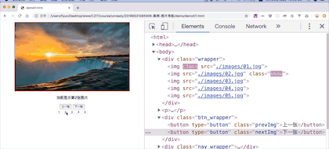

# 案例-图片导航

关键步骤：

1. 把按钮的点击事件委托给他们的父级元素

[案例源码](./demo/demo01.html)



## 优化

```js
imgs[currentIndex].classList.remove("show");
imgs[clickIndex].classList.add("show");
spanEle.textContent = clickIndex + 1;
currentIndex = clickIndex;
```

上面这段代码和前面上一张和下一张事件中的代码有相同的功能，所以这段代码也可以与之前的事件代替。
[案例源码](./demo/demo02.html)
