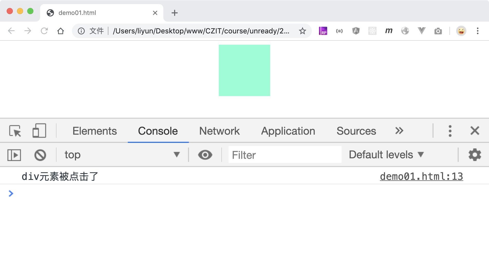
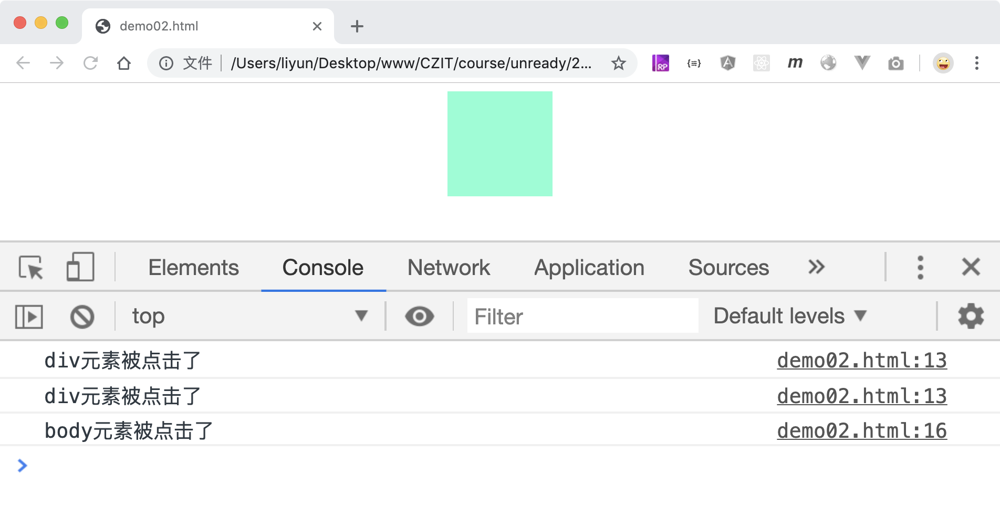

# 模拟触发事件

给元素添加的监听事件，可能是由用户的某项操作触发，也可以使用 JS 模拟触发：

```html
<style>
    div {
        width: 100px;
        height: 100px;
        margin: 0 auto;
        background-color: aquamarine;
    }
</style>
<div></div>
<script>
    var div = document.querySelector("div");
    div.addEventListener("click", function() {
        console.log("div元素被点击了");
    });

    setTimeout(function() {
        var event = new Event("click");
        div.dispatchEvent(event);
    }, 2000);
</script>
```

[案例源码](./demo/demo01.html)



在这个案例中，`Event`是一个构造函数，通过`new Event()`可以创建一个事件对象，任何元素都可以通过`dispatchEvent()`函数来模拟触发该事件。

`new Event(type [,option])`构造函数中,`type`参数表示要触发的事件名称，`option`是一个对象，用来设置模拟触发事件的配置项。

| option 属性 | 作用                                                   |
| ----------- | ------------------------------------------------------ |
| `bubbles`   | 设置该事件是否冒泡，默认是`false` ，表示事件默认不冒泡 |

```html
<style>
    div {
        width: 100px;
        height: 100px;
        margin: 0 auto;
        background-color: aquamarine;
    }
</style>
<div></div>
<script>
    var div = document.querySelector("div");
    div.addEventListener("click", function() {
        console.log("div元素被点击了");
    });
    document.body.addEventListener("click", function() {
        console.log("body元素被点击了");
    });

    setTimeout(function() {
        var event = new Event("click");
        div.dispatchEvent(event);
    }, 2000);

    setTimeout(function() {
        var event = new Event("click", {
            bubbles: true,
        });
        div.dispatchEvent(event);
    }, 4000);
</script>
```

[案例源码](./demo/demo02.html)


