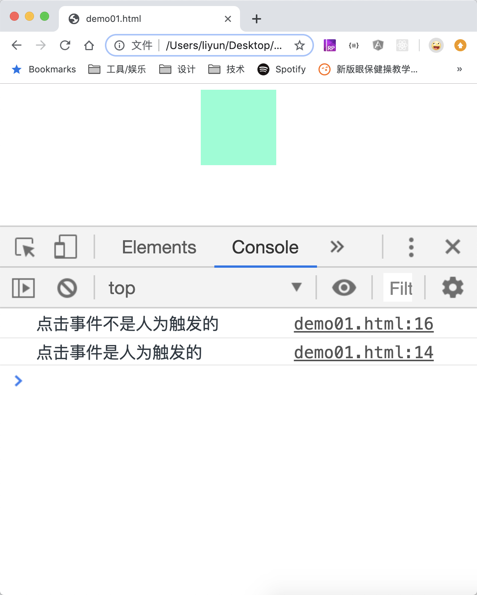

# 判断事件是否被人为触发

事件对象中还有一个属性`isTrusted`，可以用来判断触发函数执行的事件是人为触发的，还是模拟触发的

```html
<style>
    div {
        width: 100px;
        height: 100px;
        margin: 0 auto;
        background-color: aquamarine;
    }
</style>
<div></div>
<script>
    var div = document.querySelector("div");
    function clickEvent(event) {
        if (event.isTrusted) {
            console.log("点击事件是人为触发的");
        } else {
            console.log("点击事件不是人为触发的");
        }
    }

    div.addEventListener("click", clickEvent);

    setTimeout(function() {
        div.click();
    }, 2000);
</script>
```

[案例源码](./demo/demo01.html)


