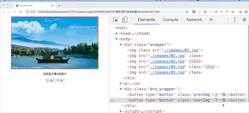

# 案例-图片自动轮播

关键步骤：

1. 把点击事件分离出来
2. 使用模拟事件，模拟触发下一张按钮的点击事件

```js
setInterval(function() {
    var event = new Event("click");
    nextBtn.dispatchEvent(event);
}, 1000);
```

[案例源码](./demo/demo01.html)


