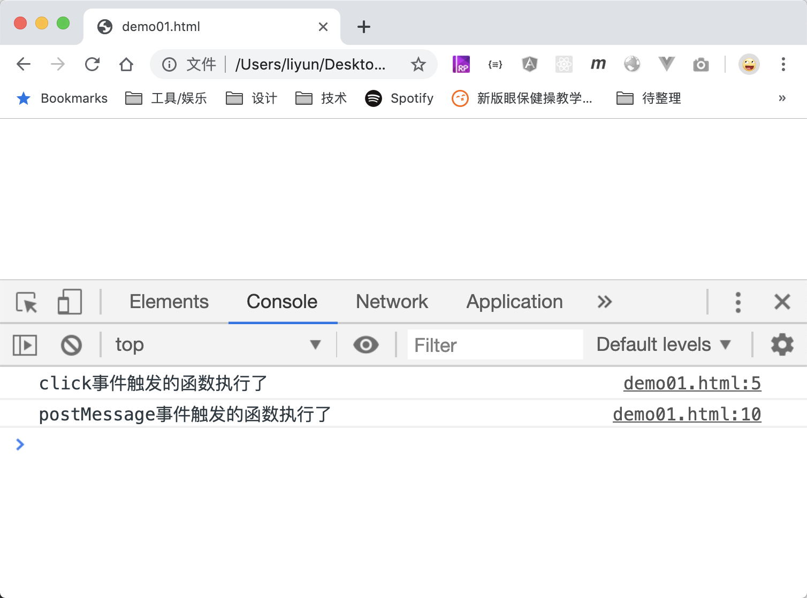

# 自定义事件

前面讲的点击事件，鼠标移入事件等，都属于系统定义的事件。前面曾经讲过了一个构造函数`new Event()`，在那一章中这个构造函数可以创建一个事件，用于模拟某些系统事件的发生。

这个构造函数还可以用来创建自定义事件：

```html
<script>
    window.onload = function() {
        // 创建自定义事件
        var event = new Event("postMessage");
        document.body.addEventListener("click", function() {
            console.log("click事件触发的函数执行了");
            // 触发自定义事件 postMessage
            document.body.dispatchEvent(event);
        });
        document.body.addEventListener("postMessage", function() {
            console.log("postMessage事件触发的函数执行了");
        });
    };
</script>
```

[案例源码](./demo/demo01.html)



在这个案例中，点击页面后，首先触发`body`元素的`click`事件，`click`事件的侦听函数在执行过程中，又触发了自定义的事件`postMessage`。
