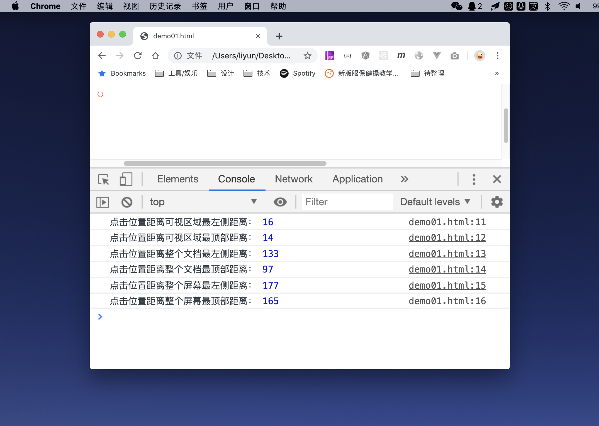

# 点击事件的特有属性

当事件发生时，事件会传递给侦听函数一个参数，这个参数叫做“事件对象”。之前讲的那些属性，属于**通用属性**，意思就是所有事件的事件对象上都可以找到这些属性。还有一些属性或者方法，是一些事件独有的。

比如鼠标事件 MouseEvent 中事件对象特有的属性：

| 属性       | 作用                                                     |
| ---------- | -------------------------------------------------------- |
| `altKey`   | `true`表示获取按下鼠标的同时，按下了`alt`键              |
| `ctrlKey`  | `true`表示获取按下鼠标的同时，按下了`ctrl`键             |
| `metaKey`  | `true`表示获取按下鼠标的同时，按下了`win`或者`command`键 |
| `shiftKey` | `true` 表示获取按下鼠标的同时，按下了`shift` 键          |
| `clientX`  | 获取点击位置距离可视区域最左侧的距离                     |
| `clientY`  | 获取点击位置距离可视区域最顶部的距离                     |
| `pageX`    | 获取点击位置距离文档最左侧的距离                         |
| `pageY`    | 获取点击位置距离文档最左侧的距离                         |
| `screenX`  | 获取点击位置距离整个屏幕最左侧的距离                     |
| `screenY`  | 获取点击位置距离整个屏幕最顶部的距离                     |

```html
<style>
    body {
        margin: 0;
        width: 200%;
        height: 200%;
    }
</style>
<script>
    window.onload = function() {
        document.body.addEventListener("click", function(event) {
            console.log("点击位置距离可视区域最左侧距离：", event.clientX);
            console.log("点击位置距离可视区域最顶部距离：", event.clientY);
            console.log("点击位置距离整个文档最左侧距离：", event.pageX);
            console.log("点击位置距离整个文档最顶部距离：", event.pageY);
            console.log("点击位置距离整个屏幕最左侧距离：", event.screenX);
            console.log("点击位置距离整个屏幕最顶部距离：", event.screenY);
        });
    };
</script>
```

[案例源码](./demo/demo01.html)


