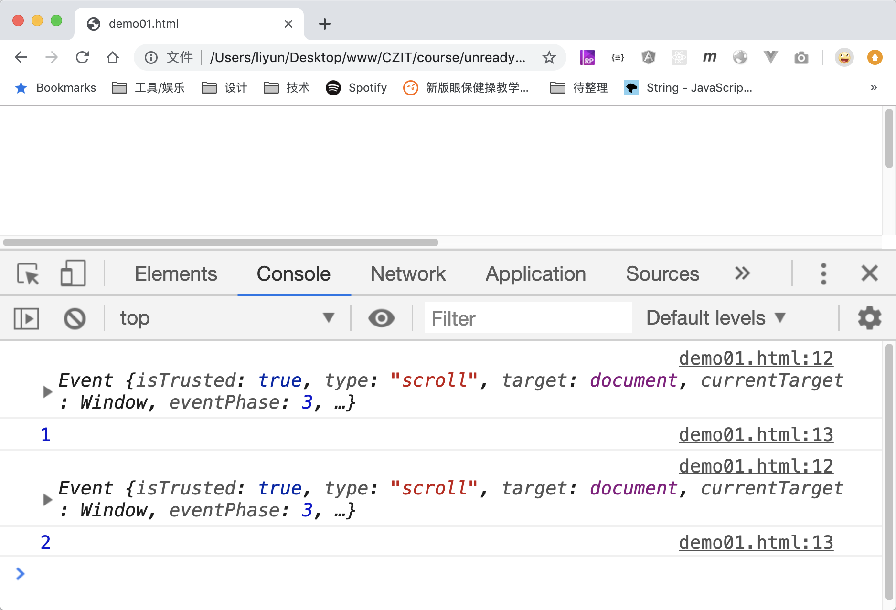

# 元素滚动事件

在元素上转动滚轮或者拖动(横向或竖向的)滚动条，都会触发元素的滚动事件:

```html
<style>
    body {
        margin: 0;
        width: 200%;
        height: 200%;
    }
</style>
<script>
    window.addEventListener(
        "scroll",
        function(event) {
            console.log(event);
            console.log(window.scrollY);
        },
        {
            once: false,
        },
    );
</script>
```

[案例源码](./demo/demo01.html)



> 如果滚动条位置不是 0，刷新页面后，通常会自动触发滚动事件，回到刷新前的位置。
