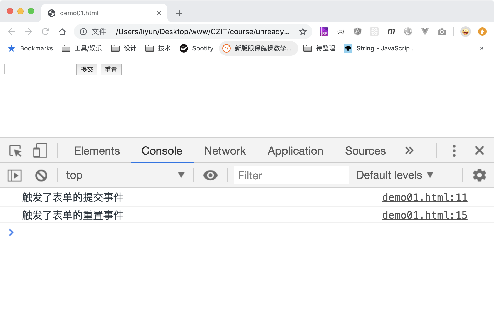
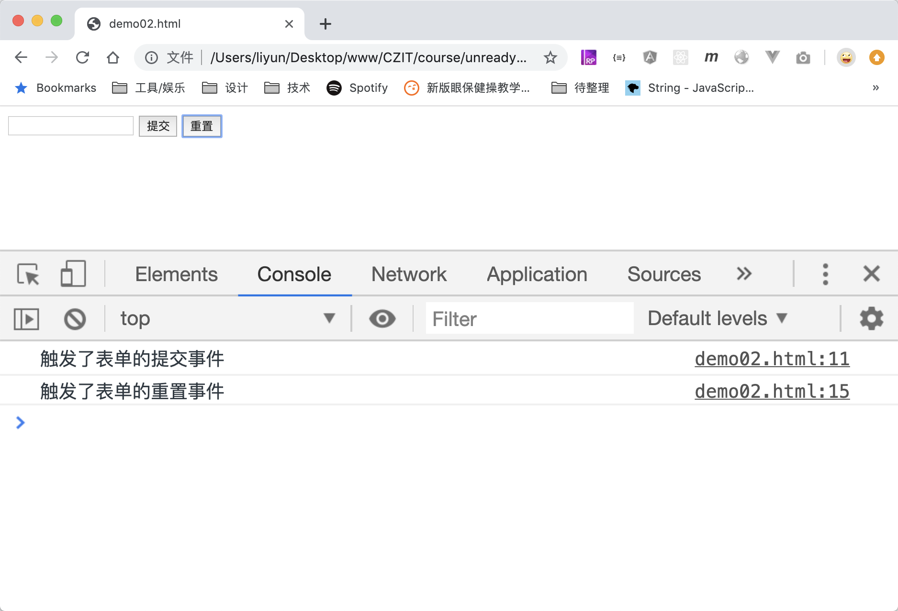

# 表单提交事件和重置事件

| 事件名   | 作用           |
| -------- | -------------- |
| `reset`  | 表单被重置事件 |
| `submit` | 表单被提交事件 |

当表单中`type=submit`的`button`元素或者`input`元素，点击时，都会触发表单的`submit(提交)`事件。

当表单中`type=reset`的`button`元素或者`input`元素，点击时，都会触发表单的`reset(重置)`事件。

```html
<form action="./demo01.html">
    <label for=""><input type="text" name="age"/></label>
    <button>提交</button>
    <button type="reset">重置</button>
</form>

<script>
    var form = document.querySelector("form");

    form.addEventListener("submit", function(event) {
        console.log("触发了表单的提交事件");
        event.preventDefault();
    });
    form.addEventListener("reset", function(event) {
        console.log("触发了表单的重置事件");
        event.preventDefault();
    });
</script>
```

[案例源码](./demo/demo01.html)



但是要注意一点：提交事件或重置事件都是只能绑定在`form`元素上的，我们点击了提交按钮或者重置按钮，触发了这些事件，仅仅是因为这两个按钮本身有一个默认的行为，不牵扯事件冒泡。从下面的案例可以来验证：

```html
<form action="./demo01.html">
    <label for=""><input type="text" name="age"/></label>
    <button>提交</button>
    <button type="reset">重置</button>
</form>

<script>
    var form = document.querySelector("form");

    form.addEventListener("submit", function(event) {
        console.log("触发了表单的提交事件");
        event.preventDefault();
    });
    form.addEventListener("reset", function(event) {
        console.log("触发了表单的重置事件");
        event.preventDefault();
    });

    var submitBtn = document.querySelector("button");
    var resetBtn = document.querySelector("button[type=reset]");
    submitBtn.addEventListener("submit", function(event) {
        console.log("触发了按钮的提交事件");
    });
    resetBtn.addEventListener("reset", function(event) {
        console.log("触发了按钮的重置事件");
    });
</script>
```

[案例源码](./demo/demo02.html)



从控制台可以看出，点击提交或者重置按钮，被触发的是`form`元素上绑定的事件，按钮本身上绑定的事件并没有执行。
