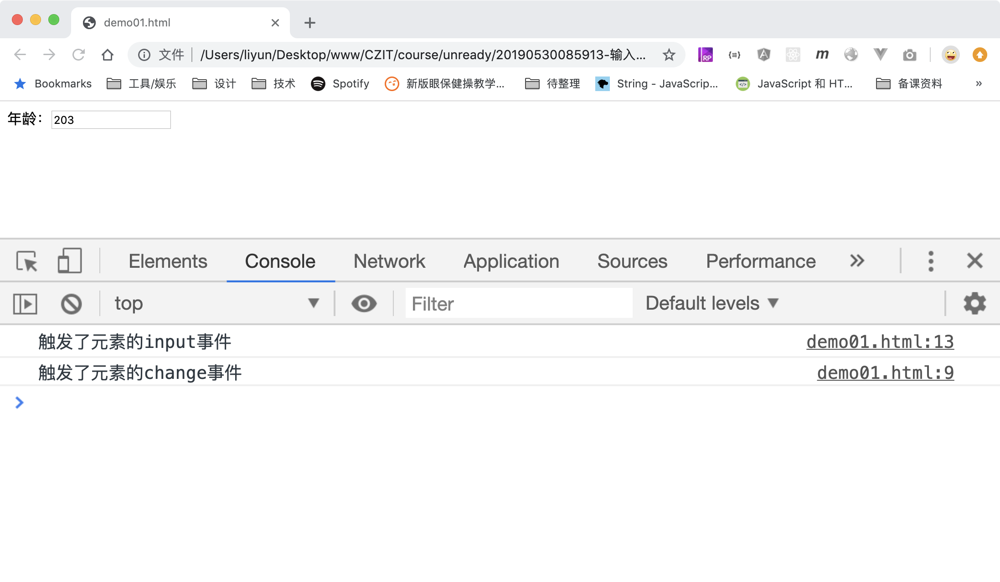

# 输入框内容改变事件

用户在输入框元素中每输入一个文字都会触发`input`事件。当焦点离开文本输入元素，且元素内的值和焦点进入元素之前的值不同时，则会触发`change`事件。

```html
<form action="./demo01.html">
    <label>年龄：<input type="text" name="age" value="20"/></label>
</form>

<script>
    var input = document.querySelector("input");
    input.addEventListener("change", function(event) {
        // 焦点离开时，元素的value值和焦点进入元素前不同时，会触发该事件
        console.log("触发了元素的change事件");
    });

    input.addEventListener("input", function(event) {
        console.log("触发了元素的input事件");
    });
</script>
```

[案例源码](./demo/demo01.html)


